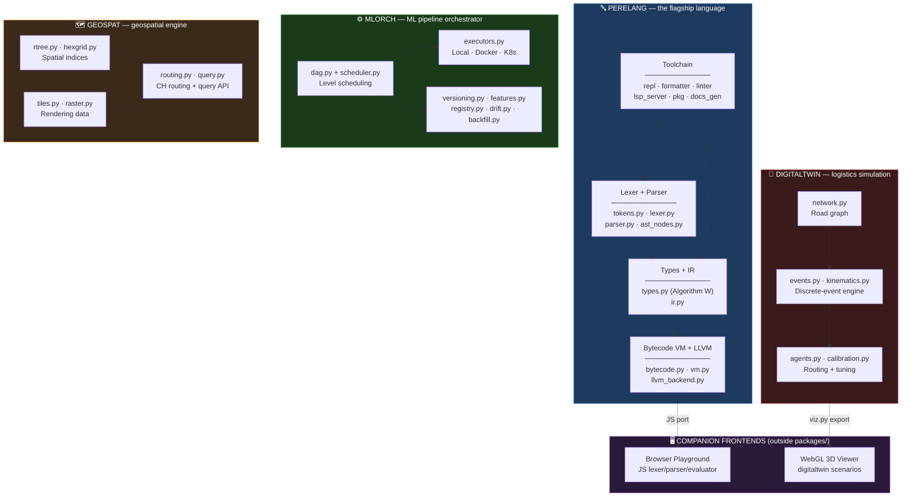
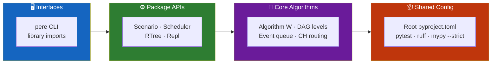
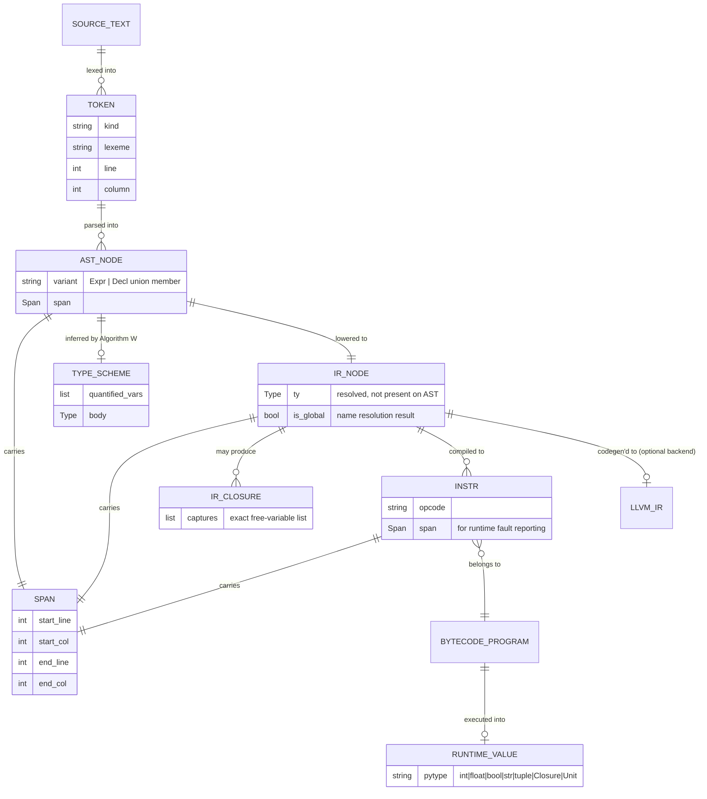
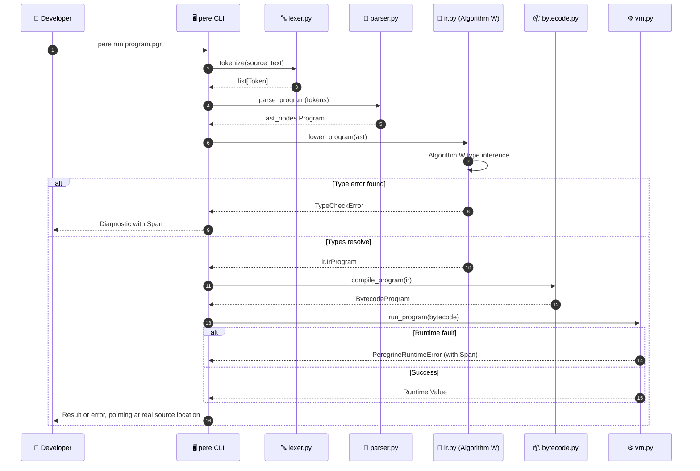
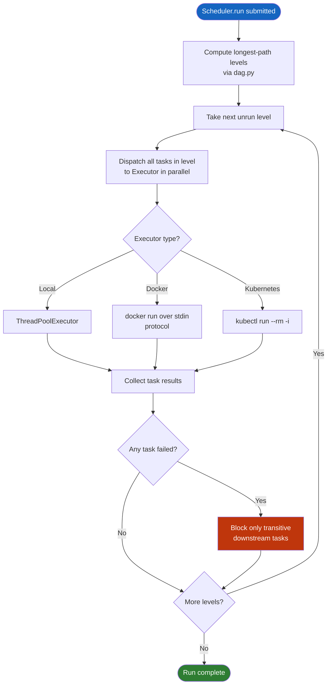
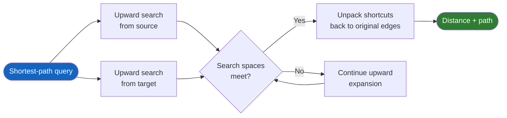
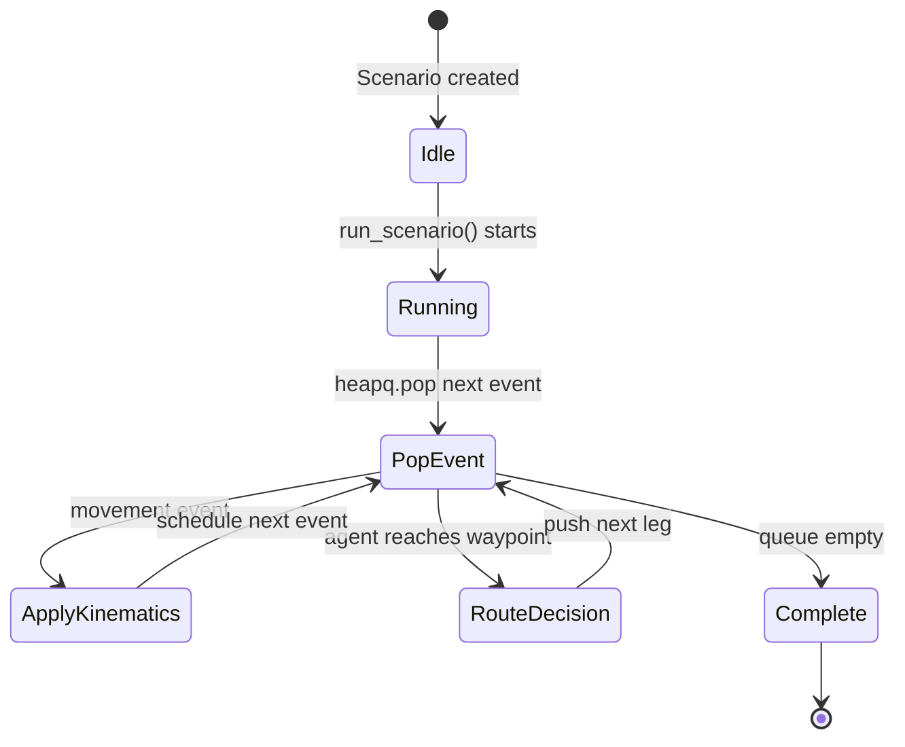
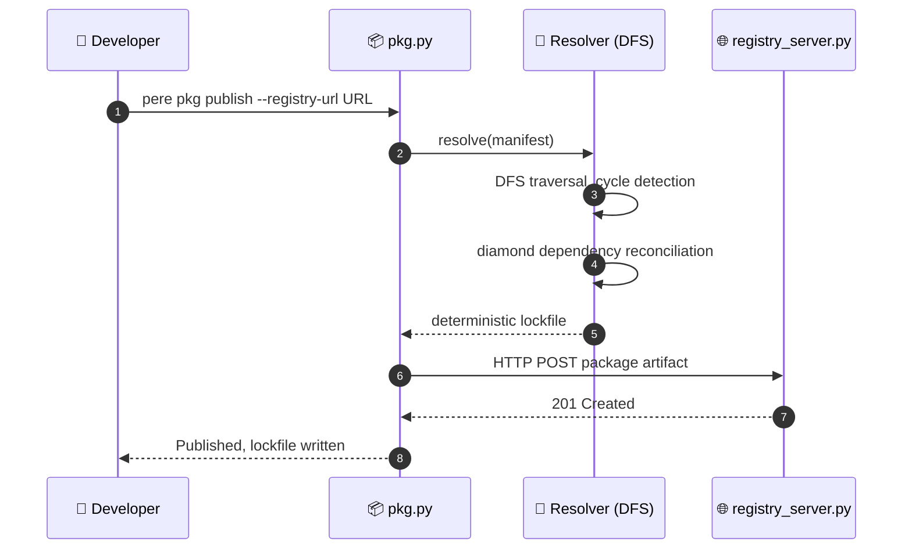
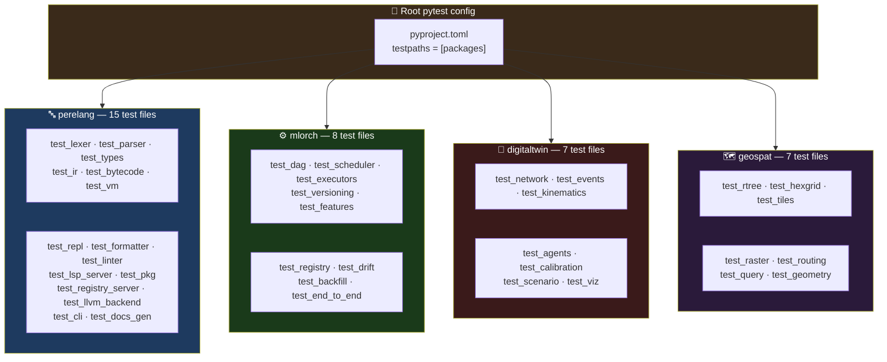

<div align="center">

**🌐 Choose Language / Selecione o Idioma / Elija el Idioma**

[](README.md)&nbsp;&nbsp;&nbsp;[](README_PT.md)&nbsp;&nbsp;&nbsp;[](README_ES.md)

</div>

---

<div align="center">

```
██████╗ ███████╗██████╗ ███████╗ ██████╗ ██████╗ ██╗███╗   ██╗███████╗
██╔══██╗██╔════╝██╔══██╗██╔════╝██╔════╝ ██╔══██╗██║████╗  ██║██╔════╝
██████╔╝█████╗  ██████╔╝█████╗  ██║  ███╗██████╔╝██║██╔██╗ ██║█████╗
██╔═══╝ ██╔══╝  ██╔══██╗██╔══╝  ██║   ██║██╔══██╗██║██║╚██╗██║██╔══╝
██║     ███████╗██║  ██║███████╗╚██████╔╝██║  ██║██║██║ ╚████║███████╗
╚═╝     ╚══════╝╚═╝  ╚═╝╚══════╝ ╚═════╝ ╚═╝  ╚═╝╚═╝╚═╝  ╚═══╝╚══════╝
      A Monorepo of Four From-Scratch Python Systems
```

---

[](https://www.python.org/)
[](https://pypi.org/project/llvmlite/)
[](https://typer.tiangolo.com/)
[](https://pytest.org/)
[](https://docs.astral.sh/ruff/)
[](https://mypy-lang.org/)
[](LICENSE)

<br/>

> **Four independent systems built from scratch, no framework doing the load-bearing work:**
> **a programming language with a full toolchain, an ML orchestrator, a logistics simulator, and a geospatial engine.**

<br/>


</div>

---

## 📑 Table of Contents

<details>
<summary>▶️ <strong>Click to expand / collapse this section</strong></summary>

<table>
<tr>
<td valign="top" width="50%">

**🏗️ System**
- [Overview](#-overview)
- [System Architecture](#-system-architecture)
- [Technology Stack](#-technology-stack)
- [Design Patterns](#-design-patterns-applied)
- [Project Structure](#-project-structure)

**📦 Modules**
- [perelang — the language](#-perelang--the-language)
- [mlorch — ML orchestrator](#-mlorch--ml-pipeline-orchestrator)
- [digitaltwin — logistics simulation](#-digitaltwin--urban-logistics-simulation)
- [geospat — geospatial engine](#-geospat--geospatial-analysis-engine)
- [Companion frontends](#-companion-frontends)

</td>
<td valign="top" width="50%">

**💼 Business**
- [Business Rules](#-business-rules)
- [Functional Requirements](#-functional-requirements)
- [Non-Functional Requirements](#-non-functional-requirements)

**📐 Design**
- [Data Model](#-data-model)
- [System Flows](#-system-flows)
- [Compiler Pipeline Flow](#compiler-pipeline-flow)
- [DAG Scheduling Flow](#dag-scheduling-flow)
- [CH Routing Query Flow](#contraction-hierarchy-query-flow)

**🔐 Security & Ops**
- [Security](#-security)
- [Installation & Execution](#-installation--execution)
- [Automated Tests](#-automated-tests)
- [Metrics & Monitoring](#-metrics--monitoring)
- [Known Limitations](#-known-limitations)

</td>
</tr>
</table>

---

</details>

## 🌟 Overview

<details>
<summary>▶️ <strong>Click to expand / collapse this section</strong></summary>

**Peregrine** is a monorepo of four independent Python systems, each built from scratch with no framework doing the load-bearing work: **`perelang`**, a programming language with a full toolchain (lexer, parser, Hindley-Milner type checker, IR, bytecode VM, an LLVM JIT backend, REPL, formatter, linter, LSP server, package manager, docs generator); **`mlorch`**, an ML pipeline orchestrator with a hand-written DAG scheduler; **`digitaltwin`**, a discrete-event urban-logistics simulation engine; and **`geospat`**, a geospatial analysis engine with a hand-written R-tree and contraction-hierarchy router.

As of the current state of the repository: **736 tests passing** (2 appropriately skipped — a Docker- and a Kubernetes-daemon-dependent test, no daemon reachable in this environment), **zero `ruff` findings**, **zero `mypy --strict` findings**, across **88 source files** and four `pip install -e`-able packages under `packages/`. Two companion, hand-rolled JavaScript frontends — a browser playground for the language and a WebGL 3D scenario viewer for `digitaltwin` — are published as standalone pages alongside the repository, outside any installable package.

The four packages share one root `pyproject.toml` for `pytest`/`ruff`/`mypy` configuration, a deliberate choice documented in [ADR 0001](docs/adr/0001-four-large-packages-not-many-small-ones.md): four large, cohesive packages rather than dozens of thin ones, matching how the Python packaging ecosystem actually expects to be used. Every package follows the same house style regardless of domain: hand-written core algorithms, frozen dataclasses for immutable values, `match` statements over `Union` type aliases for exhaustive dispatch (verified by `mypy --strict`, not just convention), and narrow exception hierarchies that never shadow a Python builtin.

### 🎯 System Objectives

| Objective | Description |
|-----------|-------------|
| 🔤 **A real language toolchain** | `perelang` covers lexing through an LLVM JIT backend, plus REPL, formatter, linter, LSP and package manager |
| 🧬 **Genuine Hindley-Milner inference** | Algorithm W with `unify`, an occurs-check, and let-polymorphism, provable via `TestLetPolymorphism` |
| ⚙️ **A DAG scheduler without Airflow** | `mlorch` hand-writes level-by-level scheduling, retries and failure containment over a `networkx` graph |
| 🚚 **Event-driven simulation, not polling** | `digitaltwin`'s clock is `heapq`-backed; movement is event-driven |
| 🗺️ **Hand-written spatial data structures** | `geospat` implements its own R-tree, hierarchical grid and contraction-hierarchy router |
| 🧪 **Provable correctness, not just green tests** | Recursion depth, closure independence, and CH-vs-Dijkstra distance agreement are directly asserted |
| 📖 **Documented scope, not hidden gaps** | Every deliberate scope cut is stated inline in the owning module's docstring and in `docs/ROADMAP.md` |
| 🖥️ **Frontends without a framework** | The browser playground and the WebGL viewer are hand-rolled, no Three.js, no parser generator |

---

</details>

## 🏗️ System Architecture

<details>
<summary>▶️ <strong>Click to expand / collapse this section</strong></summary>

### Module Diagram



### Architecture Layers



---

</details>

## 🛠️ Technology Stack

<details>
<summary>▶️ <strong>Click to expand / collapse this section</strong></summary>

<table>
<thead>
<tr>
<th>Layer</th>
<th>Technology</th>
<th>Version</th>
<th>Purpose</th>
</tr>
</thead>
<tbody>
<tr>
<td rowspan="2"><strong>🧠 Language</strong></td>
<td>Python</td>
<td>&gt;=3.12</td>
<td>Required for every package (<code>requires-python</code> in each <code>pyproject.toml</code>)</td>
</tr>
<tr>
<td>mypy strict mode</td>
<td>strict = true</td>
<td>Enforced repo-wide, <code>namespace_packages</code> + <code>explicit_package_bases</code></td>
</tr>
<tr>
<td rowspan="2"><strong>🔤 perelang core</strong></td>
<td>llvmlite (optional extra)</td>
<td>&gt;=0.48</td>
<td>JIT backend (<code>llvm_backend.py</code>) — MCJIT compilation of the language's IR</td>
</tr>
<tr>
<td>typer</td>
<td>—</td>
<td>Backs the <code>pere</code> CLI (<code>cli.py</code>)</td>
</tr>
<tr>
<td rowspan="2"><strong>⚙️ mlorch</strong></td>
<td>networkx</td>
<td>—</td>
<td>Graph storage, topological sort, cycle detection in <code>dag.py</code> (scheduling policy is hand-written)</td>
</tr>
<tr>
<td>ThreadPoolExecutor / docker / kubectl</td>
<td>stdlib / CLI subprocess</td>
<td><code>LocalExecutor</code>, <code>DockerExecutor</code>, <code>KubernetesExecutor</code> in <code>executors.py</code></td>
</tr>
<tr>
<td rowspan="2"><strong>🚚 digitaltwin</strong></td>
<td>networkx</td>
<td>—</td>
<td>Road-graph backing for <code>network.py</code>, Dijkstra routing in <code>agents.py</code></td>
</tr>
<tr>
<td>matplotlib (optional)</td>
<td>—</td>
<td>Bonus 2D plot in <code>viz.py</code>; JSON/DataFrame export is the primary path</td>
</tr>
<tr>
<td rowspan="2"><strong>🗺️ geospat</strong></td>
<td>numpy</td>
<td>—</td>
<td>Raster backing in <code>raster.py</code> (georeferencing, resampling, slope/aspect)</td>
</tr>
<tr>
<td>pandas</td>
<td>—</td>
<td>Used alongside <code>mlorch.features</code>'s offline store and some tabular exports</td>
</tr>
<tr>
<td rowspan="3"><strong>🧪 Quality gates</strong></td>
<td>pytest</td>
<td>—</td>
<td><code>testpaths = ["packages"]</code>, root-level <code>pyproject.toml</code> config</td>
</tr>
<tr>
<td>ruff</td>
<td>line-length 110</td>
<td>Rule sets <code>E, F, I, UP, B, SIM, N</code>, target <code>py312</code></td>
</tr>
<tr>
<td>mypy</td>
<td>--strict</td>
<td><code>mypy_path</code> spans all four <code>src/</code> trees; <code>networkx</code>/<code>pandas</code>/<code>llvmlite</code> stubs ignored explicitly</td>
</tr>
<tr>
<td rowspan="2"><strong>🖥️ Companion frontends</strong></td>
<td>Hand-written JavaScript</td>
<td>—</td>
<td>Browser playground: JS port of lexer/parser/tree-walking evaluator, no type checker port</td>
</tr>
<tr>
<td>WebGL (no Three.js)</td>
<td>—</td>
<td>3D scenario viewer for <code>digitaltwin.viz</code> exports, orbit camera, scrubbable timeline</td>
</tr>
</tbody>
</table>

---

</details>

## 🎨 Design Patterns Applied

<details>
<summary>▶️ <strong>Click to expand / collapse this section</strong></summary>

| Pattern | Where | Rationale |
|---------|-------|-----------|
| 🧵 **Pipeline** | `perelang`: lexer → parser → IR (`lower_program`) → bytecode (`compile_program`) → VM (`run_program`) | Each stage has one job and one typed hand-off to the next |
| 🌳 **Recursive Descent + Precedence Climbing** | `parser.py` | The full binary-operator chain (`\|\| → && → equality → comparison → additive → multiplicative → unary → call/primary`) parses without a generator |
| 🧩 **Algebraic data type via `Union` + `match`** | `ast_nodes.py`'s `Expr`/`Decl`, every consumer ending in `case _: assert_never(...)` | Adding a variant makes `mypy --strict` flag every unhandled `match`, the discriminated-union guarantee without a sealed class |
| 🏛️ **Strategy** | `digitaltwin.agents` (`nearest_neighbor` vs. `clarke_wright_routes` via `Scenario.routing_strategy`); `geospat.routing` (Dijkstra baseline vs. contraction hierarchy) | Interchangeable algorithms behind one call surface |
| 🔌 **Protocol / Adapter** | `mlorch.executors.Executor` protocol implemented by `LocalExecutor`, `DockerExecutor`, `KubernetesExecutor` | The scheduler is agnostic to where a task actually runs |
| 🧱 **Content-addressed storage** | `mlorch.versioning` — SHA-256 hashing with a JSON manifest | Deduplicates both on-disk dataset objects and consecutive-duplicate history entries |
| 🧮 **Builder** | `geospat.query.Query(index).within(bbox)...execute()` | A fluent spatial query API instead of a separately parsed textual DSL |
| 🕳️ **Fail loudly, never no-op** | `DockerExecutor`/`KubernetesExecutor` when no daemon/cluster is reachable | A missing dependency raises a named error instead of silently skipping work |
| 🧾 **Narrow exception hierarchies** | `errors.py` in every package (`TypeCheckError`, `PeregrineRuntimeError`, `LlvmBackendUnsupportedError`, ...) | One class per failure category, always ending in `Error`, never shadowing a builtin |
| 🧊 **Immutable value objects** | Frozen dataclasses throughout (`ast_nodes.py`, IR nodes, `Span`) | Structural sharing is safe by construction; no accidental aliasing bugs |

---

</details>

## 📁 Project Structure

<details>
<summary>▶️ <strong>Click to expand / collapse this section</strong></summary>

```
peregrine/
│
├── 📄 pyproject.toml                    # Shared pytest/ruff/mypy config for all four packages
├── 📄 LICENSE
├── 📄 README.md                         # This file (English, primary)
│
├── 📂 docs/
│   ├── 📄 ARCHITECTURE.md               # Full pipeline/module design per package
│   ├── 📄 ROADMAP.md                    # Deliberate scope boundaries vs. genuine follow-up work
│   └── 📂 adr/                          # 5 Architecture Decision Records
│       ├── 0001-four-large-packages-not-many-small-ones.md
│       ├── 0002-arithmetic-monomorphic-over-int.md
│       ├── 0003-llvm-backend-scope-cuts.md
│       ├── 0004-hand-rolled-lsp-transport.md
│       └── 0005-local-package-registry.md
│
└── 📂 packages/
    ├── 📂 perelang/                     # The flagship: language + full toolchain
    │   ├── 📄 pyproject.toml            # console_scripts: pere = perelang.cli:main
    │   ├── 📂 src/perelang/
    │   │   ├── lexer.py / tokens.py     # Hand-written tokenizer
    │   │   ├── parser.py / ast_nodes.py # Recursive-descent parser, frozen-dataclass AST
    │   │   ├── types.py                 # Hindley-Milner (Algorithm W)
    │   │   ├── ir.py                    # Second IR, resolved types, explicit closures
    │   │   ├── bytecode.py / vm.py      # Stack bytecode + interpreter
    │   │   ├── llvm_backend.py          # llvmlite JIT backend
    │   │   ├── repl.py                  # Testable REPL core
    │   │   ├── formatter.py / linter.py # AST-driven pretty-printer, static checks
    │   │   ├── lsp_server.py            # Hand-rolled JSON-RPC-over-stdio
    │   │   ├── pkg.py / registry_server.py  # Dependency resolver + HTTP registry
    │   │   ├── docs_gen.py              # Signature + comment extractor
    │   │   └── cli.py                   # `pere` entry point (Typer)
    │   ├── 📂 examples/                 # Runnable .pgr programs (fibonacci, closures, ...)
    │   ├── 📂 syntax/                   # TextMate grammar for editor highlighting
    │   └── 📂 tests/                    # 15 test files
    │
    ├── 📂 mlorch/                       # ML pipeline orchestrator
    │   ├── 📂 src/mlorch/
    │   │   ├── dag.py / scheduler.py    # DAG model + level-by-level execution
    │   │   ├── executors.py             # Local / Docker / Kubernetes executors
    │   │   ├── versioning.py            # Content-addressed dataset storage
    │   │   ├── features.py              # Offline (pandas) + online (dict) feature stores
    │   │   ├── registry.py              # Model registry, stage promotion
    │   │   ├── drift.py                 # Hand-implemented PSI + KS statistic
    │   │   └── backfill.py              # Incremental partition computation
    │   └── 📂 tests/                    # 8 test files
    │
    ├── 📂 digitaltwin/                  # Urban-logistics simulation
    │   ├── 📂 src/digitaltwin/
    │   │   ├── network.py               # Grid / random-geometric road graph generators
    │   │   ├── events.py                # heapq-backed event queue and clock
    │   │   ├── kinematics.py            # Closed-form constant-acceleration motion
    │   │   ├── agents.py                # Nearest-neighbor + Clarke-Wright routing
    │   │   ├── calibration.py           # Golden-section parameter search
    │   │   ├── scenario.py              # Public API: Scenario, run_scenario()
    │   │   └── viz.py                   # JSON/DataFrame export + optional matplotlib plot
    │   └── 📂 tests/                    # 7 test files
    │
    └── 📂 geospat/                      # Geospatial analysis engine
        ├── 📂 src/geospat/
        │   ├── rtree.py                 # Guttman quadratic-split R-tree
        │   ├── hexgrid.py               # Quadtree cell index (documented non-H3)
        │   ├── tiles.py                 # Slippy z/x/y vector tile generation
        │   ├── raster.py                # numpy-backed raster ops (slope/aspect, focal mean)
        │   ├── routing.py               # Dijkstra + contraction-hierarchy router
        │   └── query.py                 # Fluent spatial query builder
        └── 📂 tests/                    # 7 test files
│
├── 📄 README.md                          # 🇺🇸 English (primary)
├── 📄 README_PT.md                       # 🇧🇷 Português
└── 📄 README_ES.md                       # 🇪🇸 Español
```

---

</details>

## 📦 System Modules

<details>
<summary>▶️ <strong>Click to expand / collapse this section</strong></summary>

### 🔤 perelang — the language

The flagship package: the toolchain around the core compiler is itself most of the engineering effort, not an afterthought.

| Stage | File | Responsibility |
|-------|------|-----------------|
| Lexer | `lexer.py`, `tokens.py` | Single-pass tokenizer, line/column tracking, `//` comments discarded (recovered separately by `docs_gen.py`) |
| Parser | `parser.py`, `ast_nodes.py` | Recursive descent + precedence climbing; every node is a frozen dataclass carrying a `Span` |
| Type checker | `types.py` | Algorithm W: `Substitution`, `unify` with occurs-check, `TypeScheme`/`generalize`/`instantiate`, letrec-style recursion |
| IR | `ir.py` | Second representation with resolved types, finished name resolution (`IrName.is_global`), explicit closure captures |
| Bytecode + VM | `bytecode.py`, `vm.py` | Stack-machine instruction set; runtime values are native Python types, not a hand-rolled tagged union |
| LLVM backend | `llvm_backend.py` | `llvmlite`-based JIT via MCJIT; covers Int/Bool/Float, closures, String/List, top-level `let` globals |
| REPL | `repl.py` | Testable `Repl.submit`/`run_lines` core, separated from I/O; re-runs the full session per submission |
| Formatter | `formatter.py` | AST-driven, idempotent pretty-printer that re-derives parentheses |
| Linter | `linter.py` | Unused bindings/parameters, identical if/else branches, shadowing |
| LSP server | `lsp_server.py` | Hand-rolled JSON-RPC-over-stdio; hover, go-to-definition, references, rename, completion |
| Package manager | `pkg.py`, `registry_server.py` | DFS dependency resolver, cycle/diamond detection, deterministic lockfile; local-dir or HTTP registry |
| Docs generator | `docs_gen.py` | Extracts inferred signatures + preceding comment runs into Markdown |
| CLI | `cli.py` | `pere` entry point (Typer): `run`, `check`, `repl`, `fmt`, `lint`, `docs`, `lsp`, `pkg *`, `registry serve` |

**Stated, permanent scope limit**: the original `+ - * / %` operators are typed monomorphically over `Int` only, no implicit coercion — `Float` gets its own operator set (`+. -. *. /.`). See [ADR 0002](docs/adr/0002-arithmetic-monomorphic-over-int.md).

---

### ⚙️ mlorch — ML Pipeline Orchestrator

| Module | Responsibility |
|--------|-----------------|
| `dag.py` | `Task`/`DAG` model; graph storage, topological sort, cycle detection delegate to `networkx` |
| `scheduler.py` | Hand-written scheduling policy: parallel-eligible grouping via longest-path levels, failure blocks only transitive downstream |
| `executors.py` | `Executor` protocol; `LocalExecutor` (`ThreadPoolExecutor`), `DockerExecutor` (`docker run`-over-stdin), `KubernetesExecutor` (`kubectl run --rm -i`) |
| `versioning.py` | SHA-256 content-addressed dataset storage with a JSON manifest, deduping objects and history |
| `features.py` | Offline (pandas, entity+timestamp keyed) and online (in-memory dict) feature stores, `materialize()` bridge |
| `registry.py` | Model versioning with metadata (params, metrics, lineage) and stage promotion |
| `drift.py` | Hand-implemented PSI and two-sample KS statistic — no `scipy` dependency |
| `backfill.py` | Incremental partition computation reusing `versioning.py`'s history as the "already done" manifest |

`DockerExecutor`/`KubernetesExecutor` refuse loudly rather than silently no-opping when no daemon/cluster is reachable.

---

### 🚚 digitaltwin — Urban-Logistics Simulation

| Module | Responsibility |
|--------|-----------------|
| `network.py` | `networkx`-backed road graph with seeded grid and random-geometric synthetic generators |
| `events.py` | `heapq`-backed event queue and simulation clock — the load-bearing piece; event-driven, not fixed-timestep |
| `kinematics.py` | Closed-form trapezoidal/triangular constant-acceleration motion per segment |
| `agents.py` | Route planning; nearest-neighbor single-route heuristic and `clarke_wright_routes` multi-vehicle savings heuristic |
| `calibration.py` | Golden-section search recovering a known speed parameter from synthetic data |
| `scenario.py` | Public API — `Scenario` + `run_scenario()`, `routing_strategy` selects the heuristic |
| `viz.py` | JSON/`pandas.DataFrame` trajectory and network export, optional `matplotlib` 2D plot |

---

### 🗺️ geospat — Geospatial Analysis Engine

| Module | Responsibility |
|--------|-----------------|
| `rtree.py` | Hand-written R-tree with Guttman quadratic-split overflow handling |
| `hexgrid.py` | Quadtree over an equirectangular plane with quadkey-style cell IDs — explicitly **not** real H3 |
| `tiles.py` | Slippy `z/x/y` vector tile generation (Liang-Barsky and Sutherland-Hodgman clipping) |
| `raster.py` | `numpy`-backed rasters with georeferencing metadata, resampling, slope/aspect, focal mean |
| `routing.py` | Dijkstra baseline plus a contraction-hierarchy router with real, dynamically-recomputed edge-difference ordering |
| `query.py` | Fluent builder-pattern spatial query API |

---

### 🖥️ Companion Frontends

Two standalone pages exist alongside the repository, outside any installable package.

| Frontend | Consumes | Notable honesty |
|----------|----------|------------------|
| Browser playground | Hand-written JS port of `lexer.py`/`parser.py` plus a tree-walking evaluator | Deliberately skips the Hindley-Milner checker; its footer states this, Python toolchain stays authoritative |
| WebGL 3D scenario viewer | `digitaltwin.viz.export_network()` / `export_trajectories()` JSON | Orbit camera, no Three.js, scrubbable by simulated time, supports pasting a real exported scenario |

---

</details>

## 💼 Business Rules

<details>
<summary>▶️ <strong>Click to expand / collapse this section</strong></summary>

### 🔤 Type System & Language Rules

| # | Rule | Enforcement |
|---|------|-------------|
| BR-01 | Integer arithmetic operators (`+ - * / %`) unify only to `Int`; no implicit numeric coercion | `types.py` `Inferencer`, `unify` |
| BR-02 | Float arithmetic uses a distinct operator set (`+. -. *. /.`) | `Inferencer._FLOAT_ARITHMETIC` |
| BR-03 | `let` bindings are single-assignment; there is no reassignment in the language | `ast_nodes.py`, enforced by the parser grammar |
| BR-04 | Closures capture free variables by value at creation time | `ir.py` `IrClosure.captures`, sound because of BR-03 |
| BR-05 | Every runtime fault carries the real source `Span` of the faulting operation | `Span` threaded through `ir.py` → `bytecode.py` → `vm.py` |
| BR-06 | The LLVM `entry` boundary only marshals Int/Bool/Float; other types raise a named error | `LlvmBackendUnsupportedError` in `llvm_backend.py` |

### ⚙️ mlorch Execution Rules

| # | Rule | Enforcement |
|---|------|-------------|
| BR-07 | A task's failure blocks only its transitive downstream tasks, not the whole DAG | `scheduler.py` |
| BR-08 | Tasks at the same DAG level (no dependency between them) are parallel-eligible | `dag.py` longest-path leveling |
| BR-09 | `DockerExecutor`/`KubernetesExecutor` refuse loudly when no daemon/cluster is reachable | `executors.py` |
| BR-10 | Re-versioning identical data does not create a duplicate object or history entry | `versioning.py` content-addressed dedup |

### 🚚 digitaltwin Simulation Rules

| # | Rule | Enforcement |
|---|------|-------------|
| BR-11 | Simulation time advances strictly by event, never by fixed polling ticks | `events.py` `heapq`-backed clock |
| BR-12 | Vehicle motion follows closed-form kinematics, not iterative numerical approximation | `kinematics.py` |
| BR-13 | The routing heuristic is selected once per `Scenario`, not mixed mid-run | `scenario.py` `routing_strategy` |

### 🗺️ geospat Indexing Rules

| # | Rule | Enforcement |
|---|------|-------------|
| BR-14 | R-tree node overflow always resolves via Guttman quadratic split | `rtree.py` |
| BR-15 | Contraction-hierarchy shortcuts are only created when the witness search proves them necessary | `routing.py` |
| BR-16 | `hexgrid.py` is documented as a simplified analog, never presented as true H3 | Module docstring + `docs/ARCHITECTURE.md` |

---

</details>

## ✅ Functional Requirements

<details>
<summary>▶️ <strong>Click to expand / collapse this section</strong></summary>

| ID | Requirement | Priority | Status |
|----|-------------|----------|--------|
| **RF-01** | `pere run <file>.pgr` shall execute a program via the bytecode VM | 🔴 High | ✅ Implemented |
| **RF-02** | `pere run <file>.pgr --backend llvm` shall execute via the LLVM JIT backend | 🔴 High | ✅ Implemented |
| **RF-03** | `pere repl` shall provide an interactive session re-evaluating accumulated source | 🟡 Medium | ✅ Implemented |
| **RF-04** | `pere check` shall type-check a file without executing it | 🟡 Medium | ✅ Implemented |
| **RF-05** | `pere fmt` shall idempotently reformat a file | 🟢 Low | ✅ Implemented |
| **RF-06** | `pere lint` shall report unused bindings, unused parameters, identical branches, shadowing | 🟡 Medium | ✅ Implemented |
| **RF-07** | `pere docs` shall generate Markdown API docs from inferred signatures and comments | 🟢 Low | ✅ Implemented |
| **RF-08** | `pere lsp` shall serve hover, go-to-definition, references, rename and completion over stdio | 🟡 Medium | ✅ Implemented |
| **RF-09** | `pere pkg publish`/`install` shall resolve dependencies with cycle and diamond detection | 🟡 Medium | ✅ Implemented |
| **RF-10** | `pere registry serve` shall run a real HTTP package registry | 🟢 Low | ✅ Implemented |
| **RF-11** | `mlorch.scheduler.Scheduler` shall execute a DAG level-by-level with per-task retries | 🔴 High | ✅ Implemented |
| **RF-12** | `mlorch.executors` shall support local, Docker and Kubernetes execution behind one protocol | 🔴 High | ✅ Implemented |
| **RF-13** | `mlorch.versioning` shall content-address datasets and dedupe identical versions | 🟡 Medium | ✅ Implemented |
| **RF-14** | `mlorch.drift` shall compute PSI and KS drift statistics without `scipy` | 🟢 Low | ✅ Implemented |
| **RF-15** | `digitaltwin.scenario.run_scenario()` shall simulate agents moving over a road network | 🔴 High | ✅ Implemented |
| **RF-16** | `digitaltwin.agents` shall support nearest-neighbor and Clarke-Wright routing strategies | 🟡 Medium | ✅ Implemented |
| **RF-17** | `digitaltwin.calibration` shall recover a speed parameter from synthetic observed data | 🟢 Low | ✅ Implemented |
| **RF-18** | `digitaltwin.viz` shall export network/trajectory data as JSON and `DataFrame` | 🟡 Medium | ✅ Implemented |
| **RF-19** | `geospat.rtree.RTree` shall support insert and range query with correct results | 🔴 High | ✅ Implemented |
| **RF-20** | `geospat.routing` shall compute shortest paths matching Dijkstra exactly via contraction hierarchies | 🔴 High | ✅ Implemented |
| **RF-21** | `geospat.tiles` shall generate slippy `z/x/y` vector tiles with correct clipping | 🟡 Medium | ✅ Implemented |
| **RF-22** | `geospat.raster` shall compute slope/aspect and focal mean matching hand-computed values | 🟡 Medium | ✅ Implemented |
| **RF-23** | The browser playground shall run Peregrine source without any local install | 🟢 Low | ✅ Implemented |
| **RF-24** | The WebGL viewer shall animate exported `digitaltwin` scenarios scrubbable by time | 🟢 Low | ✅ Implemented |

---

</details>

## ⚡ Non-Functional Requirements

<details>
<summary>▶️ <strong>Click to expand / collapse this section</strong></summary>

| ID | Category | Requirement | Target |
|----|----------|-------------|--------|
| **RNF-01** | 🧪 Quality | Repository-wide `ruff` findings | 0 |
| **RNF-02** | 🧪 Quality | Repository-wide `mypy --strict` findings | 0 |
| **RNF-03** | 🧪 Testability | Test pass rate across all four packages | 736 passing, 2 honestly skipped |
| **RNF-04** | 📖 Documentation | Every deliberate scope cut stated inline in its owning module's docstring | 100% coverage, cross-referenced in `docs/ROADMAP.md` |
| **RNF-05** | 🧱 Maintainability | Each package is independently `pip install -e`-able | 4/4 packages |
| **RNF-06** | 🔀 Portability | No package depends on a GUI, database server, or hosted service to run its test suite | 0 external service dependencies for `pytest` |
| **RNF-07** | ⚡ Performance | Contraction-hierarchy queries visit fewer nodes than one-shot degree-sort ordering | Measurably fewer shortcuts and visited nodes (`test_routing.py`) |
| **RNF-08** | 🔐 Correctness | LLVM-compiled function results match the bytecode VM's results exactly | Cross-checked in `test_llvm_backend.py` |
| **RNF-09** | 🧩 Extensibility | Adding an AST node variant must be caught by the type checker if unhandled | `assert_never` + `mypy --strict` |
| **RNF-10** | 📏 Style | Source line length | ≤ 110 (`ruff` `line-length`), `E501` explicitly ignored |
| **RNF-11** | 🧵 Concurrency | `LocalExecutor` runs tasks with real OS-level thread parallelism | `ThreadPoolExecutor`-backed |
| **RNF-12** | 🌍 Reproducibility | Simulation and spatial-index tests use seeded, deterministic generators | `network.py` grid/random-geometric generators |
| **RNF-13** | 📦 Packaging | No install-time dependency required unless a package needs one | `perelang`/`mlorch` list `dependencies = []` at the root |
| **RNF-14** | 🖥️ Frontend independence | Companion pages require no build step or framework runtime | Plain hand-written JS + WebGL |
| **RNF-15** | 🧾 Traceability | Runtime errors report the exact source location that faulted | `Span` threading in `perelang` |

---

</details>

## 🗄️ Data Model

<details>
<summary>▶️ <strong>Click to expand / collapse this section</strong></summary>

This is a library monorepo, not a database-backed application. Its "data model" is the set of core in-memory/on-disk structures each package defines. The diagram below models the conceptual relationships between `perelang`'s compilation artifacts, since that package has the richest internal data shape.

### Entity-Relationship Diagram — perelang Compilation Artifacts



### mlorch / digitaltwin / geospat In-Memory Structures

| Package | Structure | Shape |
|---------|-----------|-------|
| `mlorch` | `Task` / `DAG` | Node id, callable, dependency edges; `networkx.DiGraph`-backed |
| `mlorch` | Dataset version manifest | JSON: `{hash, path, created_at, parents}`, deduped by SHA-256 |
| `mlorch` | Model registry entry | `{version, params, metrics, dataset_lineage, stage}` |
| `digitaltwin` | Road network | `networkx.Graph` with edge `length`/`speed_limit` attributes |
| `digitaltwin` | Event | `(time, priority, callback)` tuple in a `heapq` |
| `geospat` | R-tree node | Bounding box + either child nodes or leaf entries (Guttman split on overflow) |
| `geospat` | CH shortcut | `(from, to, via, weight)`, created only when witness search proves necessity |
| `geospat` | Vector tile | Custom JSON: `{z, x, y, features: [{geometry, properties}]}`, not MVT protobuf |

---

</details>

## 🔄 System Flows

<details>
<summary>▶️ <strong>Click to expand / collapse this section</strong></summary>

### Compiler Pipeline Flow



### DAG Scheduling Flow



### Contraction Hierarchy Query Flow



### Discrete-Event Simulation Loop



### Package Publish Flow



---

</details>

## 🔐 Security

<details>
<summary>▶️ <strong>Click to expand / collapse this section</strong></summary>

### Implemented Controls

| Control | Implementation | Effect |
|---------|---------------|--------|
| 🧾 **Type safety by construction** | `mypy --strict` across all four `src/` trees, zero findings | Entire classes of runtime type errors are caught before execution |
| 🚫 **Fail-loud executors** | `DockerExecutor`/`KubernetesExecutor` refuse when no daemon/cluster is reachable | No task is silently skipped or falsely reported successful |
| 🔒 **Immutable AST/IR nodes** | Frozen dataclasses throughout `ast_nodes.py`, `ir.py` | Eliminates a class of aliasing/mutation bugs in the compiler pipeline |
| 🧮 **Content-addressed integrity** | SHA-256 hashing in `mlorch.versioning` | A dataset version is verifiably the bytes it claims to be |
| 🧱 **Narrow exception hierarchies** | `errors.py` per package, always ending in `Error` | Callers can catch precisely, never accidentally swallow an unrelated builtin exception |
| 🔍 **Exhaustive match checking** | `assert_never(...)` at every `Union`-typed dispatch site | A new AST/IR variant cannot silently fall through unhandled |
| 🌐 **No untrusted code execution surface exposed by design** | `pere run` only interprets/JIT-compiles Peregrine source the user supplies locally | No network-facing eval endpoint in the language toolchain itself |

### Known Security Limitations

> [!WARNING]
> These are inherent to a monorepo of learning/demonstration systems and should be understood before any component is exposed beyond a trusted, local context.

| Limitation | Risk | Mitigation path |
|------------|------|-----------------|
| 🌐 **`registry_server.py` has no authentication** | Anyone reaching the HTTP registry can publish or install packages | Add token-based auth before exposing beyond `localhost` |
| 🖥️ **`lsp_server.py` trusts its stdio peer implicitly** | An LSP client is assumed non-adversarial, standard for local editor integrations | Acceptable for the intended local-editor use case; do not expose over an untrusted transport |
| 🐳 **`DockerExecutor`/`KubernetesExecutor` run arbitrary task payloads** | A malicious task definition executes with the invoking user's Docker/`kubectl` privileges | Sandbox or restrict the identity `mlorch` runs under in any shared environment |
| 🧪 **LLVM JIT executes machine code generated from user input** | A crafted `.pgr` program compiled via `--backend llvm` runs native code, not a sandboxed interpreter | Only run untrusted `.pgr` files through the bytecode VM, not the LLVM backend |
| 📄 **The browser playground evaluates arbitrary pasted source client-side** | Standard JS execution risk of any in-browser interpreter/evaluator | No server-side execution involved; risk is scoped to the visitor's own browser tab |
| 🗂️ **`versioning.py` does not encrypt stored dataset objects** | Data at rest is plain, hash-addressed files | Add encryption at the storage backend if handling sensitive datasets |

---

</details>

## 🚀 Installation & Execution

<details>
<summary>▶️ <strong>Click to expand / collapse this section</strong></summary>

### Prerequisites

```bash
# Python 3.12 or newer
python3 --version        # expect 3.12+

# pip, from the repo root
python -m pip --version
```

### Build (editable install of all four packages)

```bash
# From the repo root — installs all four packages in editable mode
python -m pip install -e packages/perelang -e packages/mlorch -e packages/digitaltwin -e packages/geospat

# Optional: enable perelang's LLVM JIT backend
python -m pip install -e "packages/perelang[llvm]"
```

### Execution

**The language, via the `pere` CLI:**

```bash
pere run packages/perelang/examples/fibonacci.pgr           # bytecode VM
pere run packages/perelang/examples/fibonacci.pgr --backend llvm   # LLVM JIT
pere repl                                                     # interactive session
pere check some_file.pgr                                      # type-check only
pere fmt some_file.pgr                                        # reformat in place
pere lint some_file.pgr                                       # static checks
pere docs packages/perelang/examples -o api.md                # generate docs
pere lsp                                                       # language server over stdio
pere registry serve                                            # run a real HTTP package registry
pere pkg publish --registry-url http://localhost:8000          # publish a package
```

**The other three, as libraries:**

```python
from mlorch.scheduler import Scheduler
from digitaltwin.scenario import Scenario, run_scenario
from geospat.rtree import RTree
```

### CLI / Tooling Targets

| Command | Purpose |
|---------|---------|
| `python -m pytest packages` | Run every test across all four packages |
| `python -m ruff check packages` | Lint everything (expect 0 findings) |
| `python -m mypy --strict packages` | Type-check everything (expect 0 findings) |
| `pere run <file>.pgr [--backend llvm]` | Execute a Peregrine program |
| `pere repl` | Interactive Peregrine session |
| `pere check <file>.pgr` | Type-check without executing |
| `pere fmt <file>.pgr` | Reformat in place |
| `pere lint <file>.pgr` | Static analysis |
| `pere docs <dir> -o <file>.md` | Generate API docs |
| `pere lsp` | Start the language server (stdio) |
| `pere pkg init / add / install / publish` | Package manager subcommands |
| `pere registry serve` | Start the HTTP package registry |

### Build Configuration

| Setting | Value | Declared in |
|---------|-------|-------------|
| `requires-python` | `>=3.12` | every package `pyproject.toml` |
| `perelang` console script | `pere = perelang.cli:main` | `packages/perelang/pyproject.toml` |
| `perelang` optional extra | `llvm = ["llvmlite>=0.48"]` | `packages/perelang/pyproject.toml` |
| Build backend | `setuptools.build_meta`, `setuptools>=68` | every package `pyproject.toml` |
| Package discovery | `[tool.setuptools.packages.find] where = ["src"]` | every package `pyproject.toml` |
| ruff config | `line-length = 110`, rules `E,F,I,UP,B,SIM,N`, `E501` ignored | root `pyproject.toml` |
| mypy config | `strict = true`, `namespace_packages = true`, `explicit_package_bases = true` | root `pyproject.toml` |

---

</details>

## 🧪 Automated Tests

<details>
<summary>▶️ <strong>Click to expand / collapse this section</strong></summary>

### Test Architecture



### Test Suite Overview

| Package | Test files | Notable coverage |
|---------|-----------|--------------------|
| `perelang` | 15 | Recursion depth proof, closure independence, `TestLetPolymorphism`, LLVM-vs-VM result cross-checks |
| `mlorch` | 8 (incl. `test_end_to_end.py`) | DAG leveling, executor wire protocols, drift statistics, an honestly-skipping Docker/K8s live test |
| `digitaltwin` | 7 | Kinematics against hand-computed values, Clarke-Wright grouping correctness |
| `geospat` | 7 | R-tree vs. brute-force range queries, CH-vs-Dijkstra exact distance agreement, shortcut-count comparison |

### Running the Tests

```bash
# Everything
python -m pytest packages

# One package
python -m pytest packages/perelang/tests

# One file
python -m pytest packages/geospat/tests/test_routing.py -v

# Lint and strict type-check (part of the same quality gate)
python -m ruff check packages
python -m mypy --strict packages
```

### Manual Acceptance Checklist

| # | Scenario | Expected result |
|---|----------|-----------------|
| 1 | `python -m pytest packages` | 736 passed, 2 skipped (Docker/K8s daemon absent) |
| 2 | `python -m ruff check packages` | 0 findings |
| 3 | `python -m mypy --strict packages` | 0 findings |
| 4 | `pere run packages/perelang/examples/fibonacci.pgr` | Correct Fibonacci result, no error |
| 5 | Same file with `--backend llvm` | Identical result to the bytecode VM run |
| 6 | `pere fmt` a file twice | Second run produces no diff (idempotent) |
| 7 | `pere lint` a file with an unused `let` | Reports the unused binding |
| 8 | Open a `.pgr` file in an LSP-aware editor via `pere lsp` | Hover, go-to-definition and rename work |
| 9 | `pere registry serve` + `pere pkg publish` | Package appears retrievable via `pere pkg install` |
| 10 | Load the browser playground, run a sample program | Correct output, footer notes no type checking |
| 11 | Load the WebGL viewer with a `digitaltwin` export | Agents animate along routes, timeline scrub works |

---

</details>

## 📊 Metrics & Monitoring

<details>
<summary>▶️ <strong>Click to expand / collapse this section</strong></summary>

### Codebase Metrics

| Metric | Value |
|--------|-------|
| Installable packages | 4 (`perelang`, `mlorch`, `digitaltwin`, `geospat`) |
| Source files | 88 |
| Tests passing | 736 |
| Tests appropriately skipped | 2 (Docker-daemon and Kubernetes-cluster dependent) |
| `ruff` findings | 0 |
| `mypy --strict` findings | 0 |
| Architecture Decision Records | 5 |
| Companion frontends (outside `packages/`) | 2 |
| `perelang` CLI subcommands | 9 (`run`, `check`, `repl`, `fmt`, `lint`, `docs`, `lsp`, `pkg`, `registry`) |

### Runtime / Quality Signals

| Signal | Source | Where to observe |
|--------|--------|-------------------|
| Test outcome per package | `pytest` exit code + summary line | CI logs, or `python -m pytest packages -v` |
| Lint cleanliness | `ruff check` exit code | 0 = clean |
| Type-safety regression | `mypy --strict` exit code | 0 = clean; any non-zero blocks the quality gate |
| CH routing efficiency | `test_routing.py` shortcut/visited-node counts | Compared directly against the one-shot degree-sort baseline it replaced |
| LLVM/VM result parity | `test_llvm_backend.py` | Cross-checked outputs for the same `.pgr` programs |
| Executor reachability | `DockerExecutor`/`KubernetesExecutor` startup check | Raises immediately if no daemon/cluster is reachable |

### Useful Diagnostic Commands

```bash
# Full quality gate in one pass
python -m pytest packages && python -m ruff check packages && python -m mypy --strict packages

# Count source files
find packages -name "*.py" -path "*/src/*" | wc -l

# Run only the LLVM backend tests (requires the [llvm] extra)
python -m pytest packages/perelang/tests/test_llvm_backend.py -v

# Inspect a compiled .pgr program's bytecode without running it
pere check packages/perelang/examples/factorial.pgr
```

### Standardized Test / Exit Codes

| Code | Meaning | Where |
|------|---------|-------|
| `0` | All tests passed / lint clean / type-check clean | `pytest`, `ruff check`, `mypy --strict` exit codes |
| `1` | At least one test failed, or findings reported | Same tools |
| `skipped` | Test explicitly skipped, not silently passed | 2 cases: Docker- and Kubernetes-dependent live tests |
| `TypeCheckError` | Static type error raised by `types.py` | `pere check`, `pere run` |
| `PeregrineRuntimeError` | Runtime fault with a real source `Span` | `pere run` (bytecode VM) |
| `LlvmBackendUnsupportedError` | Unsupported value type at the LLVM `entry` boundary | `pere run --backend llvm` |

---

</details>

## ⚠️ Known Limitations

<details>
<summary>▶️ <strong>Click to expand / collapse this section</strong></summary>

> [!IMPORTANT]
> Every limitation below is documented as a **deliberate, permanent scope boundary** in `docs/ROADMAP.md` and in the owning module's own docstring, not a hidden gap. As of the current state of the repository, the "genuine follow-up work" section of the roadmap is empty — everything once listed there has been closed out.

| Category | Issue | Status |
|----------|-------|--------|
| 🔤 **Arithmetic typing** | Original `+ - * / %` operators are Int-only, permanently, by design | ➕ Intentional — see [ADR 0002](docs/adr/0002-arithmetic-monomorphic-over-int.md) |
| ⚙️ **LLVM entry boundary** | `ctypes` marshaling at the outer JIT boundary only supports Int/Bool/Float | ➕ Intentional — internal call graph supports closures/String/List already |
| 🖥️ **LSP scope** | No cross-file symbol table, no signature help, no member-access completion | ➕ Intentional — the language has no `import` system to resolve through yet |
| ✏️ **Formatter comment preservation** | Comments are discarded at the lexer stage and cannot be round-tripped by the formatter | ➕ Intentional — would require threading comment-association through lexer and parser |
| 🐳 **KubernetesExecutor live verification** | Unit-tested but not exercised against a real cluster in this environment | ⚠️ Open — live end-to-end test skips honestly rather than faking a pass |
| 📊 **Drift statistics** | Hand-implemented PSI/KS, not `scipy`-backed | ➕ Intentional — `scipy` unavailable in this environment; consistent with the from-scratch ethos |
| 🚚 **Vehicle routing** | Nearest-neighbor and Clarke-Wright are heuristics, not an exact VRP optimizer | ➕ Intentional — exact VRP with time windows is out of scope |
| 🗺️ **`hexgrid.py`** | Quadtree analog, not true H3 icosahedral hexagon math | ➕ Intentional — same interface, documented simplification |
| 🗺️ **Contraction hierarchy witness search** | Full unbounded Dijkstra rather than a hop-limited local search | ➕ Intentional — shortcut decisions are always correct, just slower to compute |
| 🗺️ **Vector tiles** | Custom JSON shape, not Mapbox Vector Tile protobuf; polygon clipping has documented edge cases | ➕ Intentional — see `geometry.py` for the exact edge cases |
| 🖥️ **Browser playground fidelity** | No Hindley-Milner type checking ported to JavaScript | ➕ Intentional — footer states this; Python toolchain remains authoritative |

> [!TIP]
> If extending this project further, the highest-leverage next step named nowhere as already done is a cross-file symbol table for the LSP server, since it is the one capability every other completed toolchain feature (hover, go-to-definition, rename) is currently scoped to a single open document without.

</details>

---

<div align="center">

---

### 🦅 Peregrine

*Four systems, zero shortcuts, every scope cut stated out loud.*

[](https://www.python.org/)
[]()
[]()
[]()

<br/>

```
"A falcon doesn't need a framework to stoop at three hundred kilometers an hour.
 It needs the right primitives, hand-tuned, and nothing extra in the way."
```

</div>
