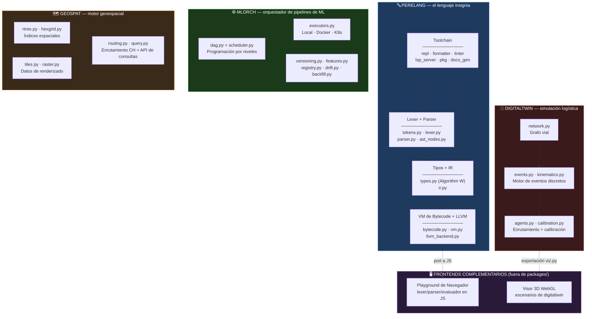
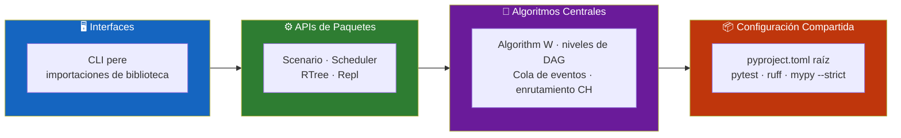
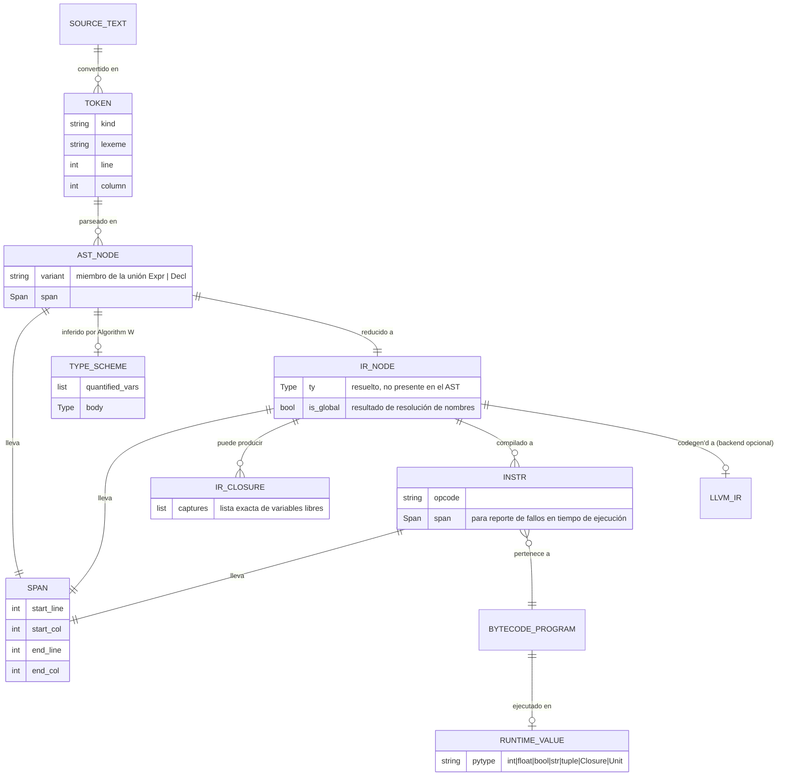
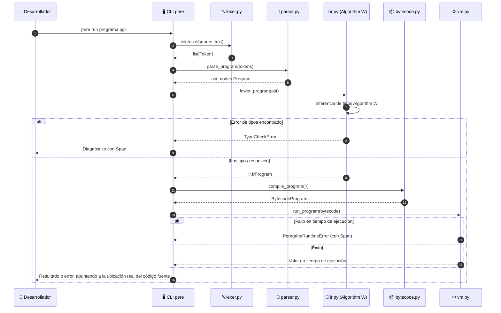
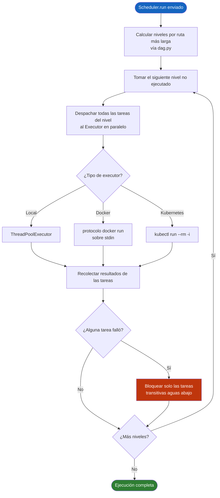
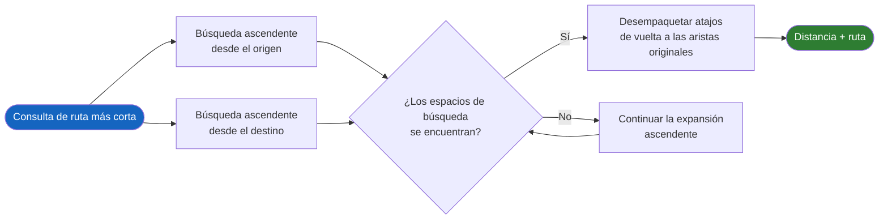
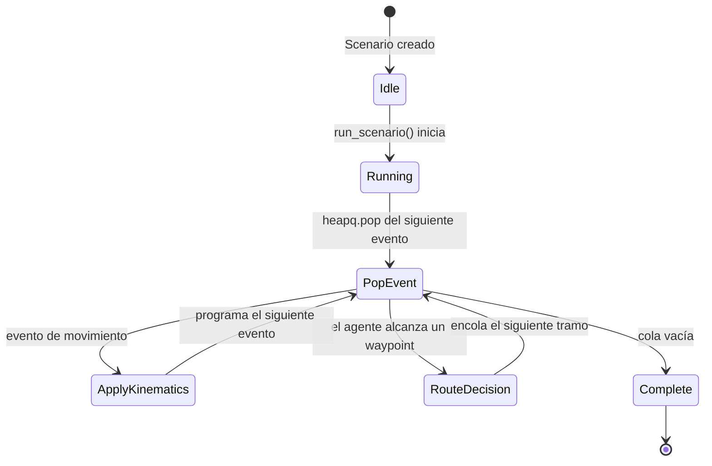
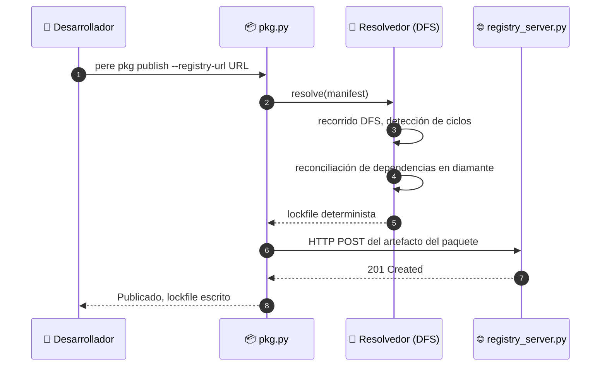
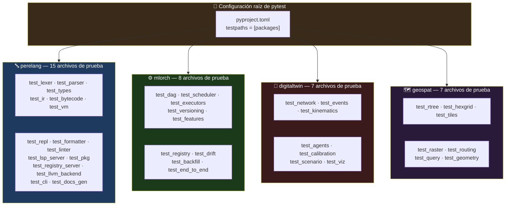

<div align="center">

**🌐 Choose Language / Selecione o Idioma / Elija el Idioma**

[](README.md)&nbsp;&nbsp;&nbsp;[](README_PT.md)&nbsp;&nbsp;&nbsp;[]()

</div>

---

<div align="center">

```
██████╗ ███████╗██████╗ ███████╗ ██████╗ ██████╗ ██╗███╗   ██╗███████╗
██╔══██╗██╔════╝██╔══██╗██╔════╝██╔════╝ ██╔══██╗██║████╗  ██║██╔════╝
██████╔╝█████╗  ██████╔╝█████╗  ██║  ███╗██████╔╝██║██╔██╗ ██║█████╗
██╔═══╝ ██╔══╝  ██╔══██╗██╔══╝  ██║   ██║██╔══██╗██║██║╚██╗██║██╔══╝
██║     ███████╗██║  ██║███████╗╚██████╔╝██║  ██║██║██║ ╚████║███████╗
╚═╝     ╚══════╝╚═╝  ╚═╝╚══════╝ ╚═════╝ ╚═╝  ╚═╝╚═╝╚═╝  ╚═══╝╚══════╝
      Un Monorepo de Cuatro Sistemas Python Construidos desde Cero
```

---

[](https://www.python.org/)
[](https://pypi.org/project/llvmlite/)
[](https://typer.tiangolo.com/)
[](https://pytest.org/)
[](https://docs.astral.sh/ruff/)
[](https://mypy-lang.org/)
[](LICENSE)

<br/>

> **Cuatro sistemas independientes construidos desde cero, sin ningún framework haciendo el trabajo pesado:**
> **un lenguaje de programación con un toolchain completo, un orquestador de ML, un simulador logístico y un motor geoespacial.**

<br/>


</div>

---

## 📑 Tabla de Contenidos

<details>
<summary>▶️ <strong>Haga clic para expandir / contraer esta sección</strong></summary>

<table>
<tr>
<td valign="top" width="50%">

**🏗️ Sistema**
- [Visión General](#-visión-general)
- [Arquitectura del Sistema](#-arquitectura-del-sistema)
- [Stack Tecnológico](#-stack-tecnológico)
- [Patrones de Diseño](#-patrones-de-diseño-aplicados)
- [Estructura del Proyecto](#-estructura-del-proyecto)

**📦 Módulos**
- [perelang — el lenguaje](#-perelang--el-lenguaje)
- [mlorch — orquestador de ML](#-mlorch--orquestador-de-pipelines-de-ml)
- [digitaltwin — simulación logística](#-digitaltwin--simulación-de-logística-urbana)
- [geospat — motor geoespacial](#-geospat--motor-de-análisis-geoespacial)
- [Frontends complementarios](#-frontends-complementarios)

</td>
<td valign="top" width="50%">

**💼 Negocio**
- [Reglas de Negocio](#-reglas-de-negocio)
- [Requisitos Funcionales](#-requisitos-funcionales)
- [Requisitos No Funcionales](#-requisitos-no-funcionales)

**📐 Diseño**
- [Modelo de Datos](#-modelo-de-datos)
- [Flujos del Sistema](#-flujos-del-sistema)
- [Flujo del Pipeline del Compilador](#flujo-del-pipeline-del-compilador)
- [Flujo de Programación del DAG](#flujo-de-programación-del-dag)
- [Flujo de Consulta de Enrutamiento CH](#flujo-de-consulta-de-jerarquía-de-contracción)

**🔐 Seguridad y Operaciones**
- [Seguridad](#-seguridad)
- [Instalación & Ejecución](#-instalación--ejecución)
- [Pruebas Automatizadas](#-pruebas-automatizadas)
- [Métricas & Monitoreo](#-métricas--monitoreo)
- [Limitaciones Conocidas](#-limitaciones-conocidas)

</td>
</tr>
</table>

---

</details>

## 🌟 Visión General

<details>
<summary>▶️ <strong>Haga clic para expandir / contraer esta sección</strong></summary>

**Peregrine** es un monorepo de cuatro sistemas Python independientes, cada uno construido desde cero sin ningún framework haciendo el trabajo pesado: **`perelang`**, un lenguaje de programación con un toolchain completo (lexer, parser, verificador de tipos Hindley-Milner, IR, VM de bytecode, un backend JIT de LLVM, REPL, formateador, linter, servidor LSP, gestor de paquetes, generador de documentación); **`mlorch`**, un orquestador de pipelines de ML con un scheduler de DAG escrito a mano; **`digitaltwin`**, un motor de simulación de logística urbana basado en eventos discretos; y **`geospat`**, un motor de análisis geoespacial con un R-tree y un router de jerarquía de contracción escritos a mano.

Según el estado actual del repositorio: **736 pruebas pasando** (2 omitidas de forma apropiada — una prueba dependiente de Docker y otra de un daemon de Kubernetes, sin daemon accesible en este entorno), **cero hallazgos de `ruff`**, **cero hallazgos de `mypy --strict`**, en **88 archivos fuente** y cuatro paquetes instalables con `pip install -e` bajo `packages/`. Dos frontends complementarios de JavaScript escritos a mano — un playground de navegador para el lenguaje y un visor 3D WebGL de escenarios para `digitaltwin` — se publican como páginas independientes junto al repositorio, fuera de cualquier paquete instalable.

Los cuatro paquetes comparten un único `pyproject.toml` raíz para la configuración de `pytest`/`ruff`/`mypy`, una decisión deliberada documentada en [ADR 0001](docs/adr/0001-four-large-packages-not-many-small-ones.md): cuatro paquetes grandes y cohesivos en lugar de decenas de paquetes pequeños, en línea con la forma en que realmente se espera usar el ecosistema de empaquetado de Python. Cada paquete sigue el mismo estilo de casa sin importar el dominio: algoritmos centrales escritos a mano, dataclasses congeladas para valores inmutables, sentencias `match` sobre alias de tipo `Union` para despacho exhaustivo (verificado por `mypy --strict`, no solo por convención), y jerarquías de excepciones acotadas que nunca ensombrecen un builtin de Python.

### 🎯 Objetivos del Sistema

| Objetivo | Descripción |
|-----------|-------------|
| 🔤 **Un toolchain de lenguaje real** | `perelang` cubre desde el lexer hasta un backend JIT de LLVM, además de REPL, formateador, linter, LSP y gestor de paquetes |
| 🧬 **Inferencia Hindley-Milner genuina** | Algorithm W con `unify`, un occurs-check y let-polymorphism, demostrable mediante `TestLetPolymorphism` |
| ⚙️ **Un scheduler de DAG sin Airflow** | `mlorch` escribe a mano la programación nivel por nivel, reintentos y contención de fallos sobre un grafo de `networkx` |
| 🚚 **Simulación dirigida por eventos, no por polling** | El reloj de `digitaltwin` se basa en `heapq`; el movimiento es dirigido por eventos |
| 🗺️ **Estructuras de datos espaciales escritas a mano** | `geospat` implementa su propio R-tree, grilla jerárquica y router de jerarquía de contracción |
| 🧪 **Corrección demostrable, no solo pruebas en verde** | La profundidad de recursión, la independencia de closures y la concordancia de distancias CH-vs-Dijkstra se afirman directamente |
| 📖 **Alcance documentado, no vacíos ocultos** | Cada recorte de alcance deliberado se indica en línea en el docstring del módulo correspondiente y en `docs/ROADMAP.md` |
| 🖥️ **Frontends sin framework** | El playground de navegador y el visor WebGL están escritos a mano, sin Three.js, sin generador de parsers |

---

</details>

## 🏗️ Arquitectura del Sistema

<details>
<summary>▶️ <strong>Haga clic para expandir / contraer esta sección</strong></summary>

### Diagrama de Módulos



### Capas de Arquitectura



---

</details>

## 🛠️ Stack Tecnológico

<details>
<summary>▶️ <strong>Haga clic para expandir / contraer esta sección</strong></summary>

<table>
<thead>
<tr>
<th>Capa</th>
<th>Tecnología</th>
<th>Versión</th>
<th>Propósito</th>
</tr>
</thead>
<tbody>
<tr>
<td rowspan="2"><strong>🧠 Lenguaje</strong></td>
<td>Python</td>
<td>&gt;=3.12</td>
<td>Requerido en todos los paquetes (<code>requires-python</code> en cada <code>pyproject.toml</code>)</td>
</tr>
<tr>
<td>modo estricto de mypy</td>
<td>strict = true</td>
<td>Aplicado en todo el repositorio, <code>namespace_packages</code> + <code>explicit_package_bases</code></td>
</tr>
<tr>
<td rowspan="2"><strong>🔤 núcleo de perelang</strong></td>
<td>llvmlite (extra opcional)</td>
<td>&gt;=0.48</td>
<td>Backend JIT (<code>llvm_backend.py</code>) — compilación MCJIT del IR del lenguaje</td>
</tr>
<tr>
<td>typer</td>
<td>—</td>
<td>Sustenta la CLI <code>pere</code> (<code>cli.py</code>)</td>
</tr>
<tr>
<td rowspan="2"><strong>⚙️ mlorch</strong></td>
<td>networkx</td>
<td>—</td>
<td>Almacenamiento del grafo, orden topológico, detección de ciclos en <code>dag.py</code> (la política de programación está escrita a mano)</td>
</tr>
<tr>
<td>ThreadPoolExecutor / docker / kubectl</td>
<td>stdlib / subproceso CLI</td>
<td><code>LocalExecutor</code>, <code>DockerExecutor</code>, <code>KubernetesExecutor</code> en <code>executors.py</code></td>
</tr>
<tr>
<td rowspan="2"><strong>🚚 digitaltwin</strong></td>
<td>networkx</td>
<td>—</td>
<td>Soporte del grafo vial para <code>network.py</code>, enrutamiento Dijkstra en <code>agents.py</code></td>
</tr>
<tr>
<td>matplotlib (opcional)</td>
<td>—</td>
<td>Gráfico 2D adicional en <code>viz.py</code>; la exportación a JSON/DataFrame es la vía principal</td>
</tr>
<tr>
<td rowspan="2"><strong>🗺️ geospat</strong></td>
<td>numpy</td>
<td>—</td>
<td>Soporte raster en <code>raster.py</code> (georreferenciación, remuestreo, pendiente/orientación)</td>
</tr>
<tr>
<td>pandas</td>
<td>—</td>
<td>Usado junto al almacén offline de <code>mlorch.features</code> y algunas exportaciones tabulares</td>
</tr>
<tr>
<td rowspan="3"><strong>🧪 Puertas de calidad</strong></td>
<td>pytest</td>
<td>—</td>
<td><code>testpaths = ["packages"]</code>, configuración en el <code>pyproject.toml</code> raíz</td>
</tr>
<tr>
<td>ruff</td>
<td>line-length 110</td>
<td>Conjuntos de reglas <code>E, F, I, UP, B, SIM, N</code>, objetivo <code>py312</code></td>
</tr>
<tr>
<td>mypy</td>
<td>--strict</td>
<td><code>mypy_path</code> abarca los cuatro árboles <code>src/</code>; stubs de <code>networkx</code>/<code>pandas</code>/<code>llvmlite</code> ignorados explícitamente</td>
</tr>
<tr>
<td rowspan="2"><strong>🖥️ Frontends complementarios</strong></td>
<td>JavaScript escrito a mano</td>
<td>—</td>
<td>Playground de navegador: port en JS del lexer/parser/evaluador de recorrido de árbol, sin port del verificador de tipos</td>
</tr>
<tr>
<td>WebGL (sin Three.js)</td>
<td>—</td>
<td>Visor 3D de escenarios para exportaciones de <code>digitaltwin.viz</code>, cámara orbital, línea de tiempo desplazable</td>
</tr>
</tbody>
</table>

---

</details>

## 🎨 Patrones de Diseño Aplicados

<details>
<summary>▶️ <strong>Haga clic para expandir / contraer esta sección</strong></summary>

| Patrón | Dónde | Justificación |
|---------|-------|-----------|
| 🧵 **Pipeline** | `perelang`: lexer → parser → IR (`lower_program`) → bytecode (`compile_program`) → VM (`run_program`) | Cada etapa tiene una sola responsabilidad y una única entrega tipada a la siguiente |
| 🌳 **Descenso Recursivo + Precedence Climbing** | `parser.py` | Toda la cadena de operadores binarios (`\|\| → && → equality → comparison → additive → multiplicative → unary → call/primary`) se parsea sin un generador |
| 🧩 **Tipo de dato algebraico vía `Union` + `match`** | `Expr`/`Decl` de `ast_nodes.py`, todo consumidor que termina en `case _: assert_never(...)` | Agregar una variante hace que `mypy --strict` marque todo `match` no manejado, la garantía de unión discriminada sin una clase sellada |
| 🏛️ **Strategy** | `digitaltwin.agents` (`nearest_neighbor` vs. `clarke_wright_routes` vía `Scenario.routing_strategy`); `geospat.routing` (línea base Dijkstra vs. jerarquía de contracción) | Algoritmos intercambiables detrás de una única superficie de llamada |
| 🔌 **Protocol / Adapter** | Protocolo `mlorch.executors.Executor` implementado por `LocalExecutor`, `DockerExecutor`, `KubernetesExecutor` | El scheduler es agnóstico de dónde se ejecuta realmente una tarea |
| 🧱 **Almacenamiento direccionado por contenido** | `mlorch.versioning` — hashing SHA-256 con un manifiesto JSON | Deduplica tanto los objetos de datasets en disco como las entradas de historial duplicadas consecutivas |
| 🧮 **Builder** | `geospat.query.Query(index).within(bbox)...execute()` | Una API fluida de consultas espaciales en lugar de un DSL textual parseado por separado |
| 🕳️ **Fallar en voz alta, nunca no-op silencioso** | `DockerExecutor`/`KubernetesExecutor` cuando no hay daemon/clúster accesible | Una dependencia faltante lanza un error con nombre en lugar de omitir el trabajo silenciosamente |
| 🧾 **Jerarquías de excepciones acotadas** | `errors.py` en cada paquete (`TypeCheckError`, `PeregrineRuntimeError`, `LlvmBackendUnsupportedError`, ...) | Una clase por categoría de fallo, siempre terminando en `Error`, nunca ensombreciendo un builtin |
| 🧊 **Objetos de valor inmutables** | Dataclasses congeladas en todo el código (`ast_nodes.py`, nodos IR, `Span`) | El compartir estructural es seguro por construcción; sin bugs de aliasing accidental |

---

</details>

## 📁 Estructura del Proyecto

<details>
<summary>▶️ <strong>Haga clic para expandir / contraer esta sección</strong></summary>

```
peregrine/
│
├── 📄 pyproject.toml                    # Configuración compartida de pytest/ruff/mypy para los cuatro paquetes
├── 📄 LICENSE
├── 📄 README.md                         # Este archivo (inglés, principal)
│
├── 📂 docs/
│   ├── 📄 ARCHITECTURE.md               # Diseño completo del pipeline/módulos por paquete
│   ├── 📄 ROADMAP.md                    # Límites de alcance deliberados vs. trabajo de seguimiento genuino
│   └── 📂 adr/                          # 5 Architecture Decision Records
│       ├── 0001-four-large-packages-not-many-small-ones.md
│       ├── 0002-arithmetic-monomorphic-over-int.md
│       ├── 0003-llvm-backend-scope-cuts.md
│       ├── 0004-hand-rolled-lsp-transport.md
│       └── 0005-local-package-registry.md
│
└── 📂 packages/
    ├── 📂 perelang/                     # El insignia: lenguaje + toolchain completo
    │   ├── 📄 pyproject.toml            # console_scripts: pere = perelang.cli:main
    │   ├── 📂 src/perelang/
    │   │   ├── lexer.py / tokens.py     # Tokenizador escrito a mano
    │   │   ├── parser.py / ast_nodes.py # Parser de descenso recursivo, AST con dataclasses congeladas
    │   │   ├── types.py                 # Hindley-Milner (Algorithm W)
    │   │   ├── ir.py                    # Segundo IR, tipos resueltos, closures explícitos
    │   │   ├── bytecode.py / vm.py      # Bytecode de pila + intérprete
    │   │   ├── llvm_backend.py          # Backend JIT con llvmlite
    │   │   ├── repl.py                  # Núcleo del REPL testeable
    │   │   ├── formatter.py / linter.py # Pretty-printer guiado por AST, verificaciones estáticas
    │   │   ├── lsp_server.py            # JSON-RPC sobre stdio escrito a mano
    │   │   ├── pkg.py / registry_server.py  # Resolvedor de dependencias + registro HTTP
    │   │   ├── docs_gen.py              # Extractor de firmas + comentarios
    │   │   └── cli.py                   # Punto de entrada `pere` (Typer)
    │   ├── 📂 examples/                 # Programas .pgr ejecutables (fibonacci, closures, ...)
    │   ├── 📂 syntax/                   # Gramática TextMate para resaltado en editores
    │   └── 📂 tests/                    # 15 archivos de prueba
    │
    ├── 📂 mlorch/                       # Orquestador de pipelines de ML
    │   ├── 📂 src/mlorch/
    │   │   ├── dag.py / scheduler.py    # Modelo de DAG + ejecución nivel por nivel
    │   │   ├── executors.py             # Executores Local / Docker / Kubernetes
    │   │   ├── versioning.py            # Almacenamiento de datasets direccionado por contenido
    │   │   ├── features.py              # Almacenes de features offline (pandas) + online (dict)
    │   │   ├── registry.py              # Registro de modelos, promoción de etapas
    │   │   ├── drift.py                 # PSI + estadístico KS implementados a mano
    │   │   └── backfill.py              # Cómputo incremental de particiones
    │   └── 📂 tests/                    # 8 archivos de prueba
    │
    ├── 📂 digitaltwin/                  # Simulación de logística urbana
    │   ├── 📂 src/digitaltwin/
    │   │   ├── network.py               # Generadores de grafo vial en grilla / geométrico aleatorio
    │   │   ├── events.py                # Cola de eventos y reloj basados en heapq
    │   │   ├── kinematics.py            # Movimiento de aceleración constante en forma cerrada
    │   │   ├── agents.py                # Enrutamiento nearest-neighbor + Clarke-Wright
    │   │   ├── calibration.py           # Búsqueda de parámetros por sección áurea
    │   │   ├── scenario.py              # API pública: Scenario, run_scenario()
    │   │   └── viz.py                   # Exportación JSON/DataFrame + gráfico opcional con matplotlib
    │   └── 📂 tests/                    # 7 archivos de prueba
    │
    └── 📂 geospat/                      # Motor de análisis geoespacial
        ├── 📂 src/geospat/
        │   ├── rtree.py                 # R-tree con división cuadrática de Guttman
        │   ├── hexgrid.py               # Índice de celdas con quadtree (documentado como no-H3)
        │   ├── tiles.py                 # Generación de vector tiles slippy z/x/y
        │   ├── raster.py                # Operaciones raster con numpy (pendiente/orientación, media focal)
        │   ├── routing.py               # Router Dijkstra + jerarquía de contracción
        │   └── query.py                 # Constructor fluido de consultas espaciales
        └── 📂 tests/                    # 7 archivos de prueba
│
├── 📄 README.md                          # 🇺🇸 Inglés (principal)
├── 📄 README_PT.md                       # 🇧🇷 Português
└── 📄 README_ES.md                       # 🇪🇸 Español
```

---

</details>

## 📦 Módulos del Sistema

<details>
<summary>▶️ <strong>Haga clic para expandir / contraer esta sección</strong></summary>

### 🔤 perelang — el lenguaje

El paquete insignia: el toolchain alrededor del compilador central es en sí mismo la mayor parte del esfuerzo de ingeniería, no un añadido tardío.

| Etapa | Archivo | Responsabilidad |
|-------|------|-----------------|
| Lexer | `lexer.py`, `tokens.py` | Tokenizador de una sola pasada, seguimiento de línea/columna, comentarios `//` descartados (recuperados por separado por `docs_gen.py`) |
| Parser | `parser.py`, `ast_nodes.py` | Descenso recursivo + precedence climbing; cada nodo es una dataclass congelada que lleva un `Span` |
| Verificador de tipos | `types.py` | Algorithm W: `Substitution`, `unify` con occurs-check, `TypeScheme`/`generalize`/`instantiate`, recursión estilo letrec |
| IR | `ir.py` | Segunda representación con tipos resueltos, resolución de nombres finalizada (`IrName.is_global`), capturas de closures explícitas |
| Bytecode + VM | `bytecode.py`, `vm.py` | Conjunto de instrucciones de máquina de pila; los valores en tiempo de ejecución son tipos nativos de Python, no una unión etiquetada hecha a mano |
| Backend LLVM | `llvm_backend.py` | JIT basado en `llvmlite` vía MCJIT; cubre Int/Bool/Float, closures, String/List, globales `let` de nivel superior |
| REPL | `repl.py` | Núcleo testeable `Repl.submit`/`run_lines`, separado de E/S; re-ejecuta toda la sesión en cada envío |
| Formateador | `formatter.py` | Pretty-printer idempotente guiado por AST que re-deriva los paréntesis |
| Linter | `linter.py` | Bindings/parámetros sin usar, ramas if/else idénticas, shadowing |
| Servidor LSP | `lsp_server.py` | JSON-RPC sobre stdio escrito a mano; hover, ir a definición, referencias, renombrar, autocompletado |
| Gestor de paquetes | `pkg.py`, `registry_server.py` | Resolvedor de dependencias por DFS, detección de ciclos/diamantes, lockfile determinista; registro local o HTTP |
| Generador de documentación | `docs_gen.py` | Extrae firmas inferidas + bloques de comentarios precedentes a Markdown |
| CLI | `cli.py` | Punto de entrada `pere` (Typer): `run`, `check`, `repl`, `fmt`, `lint`, `docs`, `lsp`, `pkg *`, `registry serve` |

**Límite de alcance declarado y permanente**: los operadores originales `+ - * / %` están tipados de forma monomórfica solo sobre `Int`, sin coerción implícita — `Float` tiene su propio conjunto de operadores (`+. -. *. /.`). Ver [ADR 0002](docs/adr/0002-arithmetic-monomorphic-over-int.md).

---

### ⚙️ mlorch — Orquestador de Pipelines de ML

| Módulo | Responsabilidad |
|--------|-----------------|
| `dag.py` | Modelo `Task`/`DAG`; almacenamiento del grafo, orden topológico y detección de ciclos delegados a `networkx` |
| `scheduler.py` | Política de programación escrita a mano: agrupación paralelizable vía niveles de ruta más larga, un fallo bloquea solo el flujo aguas abajo transitivo |
| `executors.py` | Protocolo `Executor`; `LocalExecutor` (`ThreadPoolExecutor`), `DockerExecutor` (`docker run` sobre stdin), `KubernetesExecutor` (`kubectl run --rm -i`) |
| `versioning.py` | Almacenamiento de datasets direccionado por contenido SHA-256 con un manifiesto JSON, deduplicando objetos e historial |
| `features.py` | Almacenes de features offline (pandas, indexado por entidad+timestamp) y online (dict en memoria), puente `materialize()` |
| `registry.py` | Versionado de modelos con metadatos (parámetros, métricas, linaje) y promoción de etapas |
| `drift.py` | PSI y estadístico KS de dos muestras implementados a mano — sin dependencia de `scipy` |
| `backfill.py` | Cómputo incremental de particiones reutilizando el historial de `versioning.py` como manifiesto de "ya hecho" |

`DockerExecutor`/`KubernetesExecutor` se niegan en voz alta en lugar de fallar silenciosamente cuando no hay daemon/clúster accesible.

---

### 🚚 digitaltwin — Simulación de Logística Urbana

| Módulo | Responsabilidad |
|--------|-----------------|
| `network.py` | Grafo vial basado en `networkx` con generadores sintéticos de grilla y geométrico aleatorio con semilla |
| `events.py` | Cola de eventos y reloj de simulación basados en `heapq` — la pieza fundamental; dirigido por eventos, no de paso fijo |
| `kinematics.py` | Movimiento trapezoidal/triangular de aceleración constante en forma cerrada por segmento |
| `agents.py` | Planificación de rutas; heurística de una sola ruta nearest-neighbor y heurística de ahorros multi-vehículo `clarke_wright_routes` |
| `calibration.py` | Búsqueda por sección áurea que recupera un parámetro de velocidad conocido a partir de datos sintéticos |
| `scenario.py` | API pública — `Scenario` + `run_scenario()`, `routing_strategy` selecciona la heurística |
| `viz.py` | Exportación de trayectorias y red a JSON/`pandas.DataFrame`, gráfico 2D opcional con `matplotlib` |

---

### 🗺️ geospat — Motor de Análisis Geoespacial

| Módulo | Responsabilidad |
|--------|-----------------|
| `rtree.py` | R-tree escrito a mano con manejo de desbordamiento por división cuadrática de Guttman |
| `hexgrid.py` | Quadtree sobre un plano equirrectangular con IDs de celda estilo quadkey — explícitamente **no** es H3 real |
| `tiles.py` | Generación de vector tiles slippy `z/x/y` (recorte de Liang-Barsky y Sutherland-Hodgman) |
| `raster.py` | Rasters respaldados por `numpy` con metadatos de georreferenciación, remuestreo, pendiente/orientación, media focal |
| `routing.py` | Línea base Dijkstra más un router de jerarquía de contracción con ordenamiento real de diferencia de grado recalculado dinámicamente |
| `query.py` | API fluida de consultas espaciales con patrón builder |

---

### 🖥️ Frontends Complementarios

Existen dos páginas independientes junto al repositorio, fuera de cualquier paquete instalable.

| Frontend | Consume | Honestidad destacable |
|----------|----------|------------------|
| Playground de navegador | Port en JS escrito a mano de `lexer.py`/`parser.py` más un evaluador de recorrido de árbol | Omite deliberadamente el verificador Hindley-Milner; su pie de página lo indica, el toolchain de Python sigue siendo la fuente autoritativa |
| Visor 3D WebGL de escenarios | JSON de `digitaltwin.viz.export_network()` / `export_trajectories()` | Cámara orbital, sin Three.js, desplazable por tiempo simulado, admite pegar un escenario exportado real |

---

</details>

## 💼 Reglas de Negocio

<details>
<summary>▶️ <strong>Haga clic para expandir / contraer esta sección</strong></summary>

### 🔤 Reglas del Sistema de Tipos y del Lenguaje

| # | Regla | Aplicación |
|---|------|-------------|
| RN-01 | Los operadores aritméticos enteros (`+ - * / %`) unifican solo con `Int`; sin coerción numérica implícita | `Inferencer`, `unify` en `types.py` |
| RN-02 | La aritmética de punto flotante usa un conjunto de operadores distinto (`+. -. *. /.`) | `Inferencer._FLOAT_ARITHMETIC` |
| RN-03 | Los bindings `let` son de asignación única; no existe reasignación en el lenguaje | `ast_nodes.py`, impuesto por la gramática del parser |
| RN-04 | Los closures capturan variables libres por valor en el momento de su creación | `IrClosure.captures` en `ir.py`, sólido gracias a RN-03 |
| RN-05 | Todo fallo en tiempo de ejecución lleva el `Span` real de origen de la operación que falló | `Span` propagado a través de `ir.py` → `bytecode.py` → `vm.py` |
| RN-06 | La frontera `entry` de LLVM solo transfiere Int/Bool/Float; otros tipos lanzan un error con nombre | `LlvmBackendUnsupportedError` en `llvm_backend.py` |

### ⚙️ Reglas de Ejecución de mlorch

| # | Regla | Aplicación |
|---|------|-------------|
| RN-07 | El fallo de una tarea bloquea solo sus tareas transitivas aguas abajo, no todo el DAG | `scheduler.py` |
| RN-08 | Las tareas en el mismo nivel del DAG (sin dependencia entre ellas) son paralelizables | Nivelado por ruta más larga en `dag.py` |
| RN-09 | `DockerExecutor`/`KubernetesExecutor` se niegan en voz alta cuando no hay daemon/clúster accesible | `executors.py` |
| RN-10 | Volver a versionar datos idénticos no crea un objeto ni una entrada de historial duplicados | Deduplicación direccionada por contenido en `versioning.py` |

### 🚚 Reglas de Simulación de digitaltwin

| # | Regla | Aplicación |
|---|------|-------------|
| RN-11 | El tiempo de simulación avanza estrictamente por evento, nunca por ticks de polling fijos | Reloj basado en `heapq` en `events.py` |
| RN-12 | El movimiento del vehículo sigue cinemática en forma cerrada, no una aproximación numérica iterativa | `kinematics.py` |
| RN-13 | La heurística de enrutamiento se selecciona una vez por `Scenario`, no se mezcla a mitad de ejecución | `routing_strategy` en `scenario.py` |

### 🗺️ Reglas de Indexación de geospat

| # | Regla | Aplicación |
|---|------|-------------|
| RN-14 | El desbordamiento de nodos del R-tree siempre se resuelve mediante división cuadrática de Guttman | `rtree.py` |
| RN-15 | Los atajos de la jerarquía de contracción solo se crean cuando la búsqueda de testigos prueba que son necesarios | `routing.py` |
| RN-16 | `hexgrid.py` está documentado como un análogo simplificado, nunca presentado como H3 verdadero | Docstring del módulo + `docs/ARCHITECTURE.md` |

---

</details>

## ✅ Requisitos Funcionales

<details>
<summary>▶️ <strong>Haga clic para expandir / contraer esta sección</strong></summary>

| ID | Requisito | Prioridad | Estado |
|----|-------------|----------|--------|
| **RF-01** | `pere run <archivo>.pgr` debe ejecutar un programa mediante la VM de bytecode | 🔴 Alta | ✅ Implementado |
| **RF-02** | `pere run <archivo>.pgr --backend llvm` debe ejecutar mediante el backend JIT de LLVM | 🔴 Alta | ✅ Implementado |
| **RF-03** | `pere repl` debe proveer una sesión interactiva que reevalúa el código acumulado | 🟡 Media | ✅ Implementado |
| **RF-04** | `pere check` debe verificar los tipos de un archivo sin ejecutarlo | 🟡 Media | ✅ Implementado |
| **RF-05** | `pere fmt` debe reformatear un archivo de forma idempotente | 🟢 Baja | ✅ Implementado |
| **RF-06** | `pere lint` debe reportar bindings sin usar, parámetros sin usar, ramas idénticas, shadowing | 🟡 Media | ✅ Implementado |
| **RF-07** | `pere docs` debe generar documentación de API en Markdown a partir de firmas inferidas y comentarios | 🟢 Baja | ✅ Implementado |
| **RF-08** | `pere lsp` debe servir hover, ir a definición, referencias, renombrar y autocompletado sobre stdio | 🟡 Media | ✅ Implementado |
| **RF-09** | `pere pkg publish`/`install` debe resolver dependencias con detección de ciclos y diamantes | 🟡 Media | ✅ Implementado |
| **RF-10** | `pere registry serve` debe ejecutar un registro de paquetes HTTP real | 🟢 Baja | ✅ Implementado |
| **RF-11** | `mlorch.scheduler.Scheduler` debe ejecutar un DAG nivel por nivel con reintentos por tarea | 🔴 Alta | ✅ Implementado |
| **RF-12** | `mlorch.executors` debe soportar ejecución local, Docker y Kubernetes detrás de un único protocolo | 🔴 Alta | ✅ Implementado |
| **RF-13** | `mlorch.versioning` debe direccionar datasets por contenido y deduplicar versiones idénticas | 🟡 Media | ✅ Implementado |
| **RF-14** | `mlorch.drift` debe calcular estadísticos de drift PSI y KS sin `scipy` | 🟢 Baja | ✅ Implementado |
| **RF-15** | `digitaltwin.scenario.run_scenario()` debe simular agentes moviéndose sobre una red vial | 🔴 Alta | ✅ Implementado |
| **RF-16** | `digitaltwin.agents` debe soportar las estrategias de enrutamiento nearest-neighbor y Clarke-Wright | 🟡 Media | ✅ Implementado |
| **RF-17** | `digitaltwin.calibration` debe recuperar un parámetro de velocidad a partir de datos sintéticos observados | 🟢 Baja | ✅ Implementado |
| **RF-18** | `digitaltwin.viz` debe exportar datos de red/trayectorias como JSON y `DataFrame` | 🟡 Media | ✅ Implementado |
| **RF-19** | `geospat.rtree.RTree` debe soportar inserción y consultas de rango con resultados correctos | 🔴 Alta | ✅ Implementado |
| **RF-20** | `geospat.routing` debe calcular rutas más cortas que coincidan exactamente con Dijkstra mediante jerarquías de contracción | 🔴 Alta | ✅ Implementado |
| **RF-21** | `geospat.tiles` debe generar vector tiles slippy `z/x/y` con un recorte correcto | 🟡 Media | ✅ Implementado |
| **RF-22** | `geospat.raster` debe calcular pendiente/orientación y media focal coincidiendo con valores calculados a mano | 🟡 Media | ✅ Implementado |
| **RF-23** | El playground de navegador debe ejecutar código fuente de Peregrine sin ninguna instalación local | 🟢 Baja | ✅ Implementado |
| **RF-24** | El visor WebGL debe animar escenarios exportados de `digitaltwin` desplazables en el tiempo | 🟢 Baja | ✅ Implementado |

---

</details>

## ⚡ Requisitos No Funcionales

<details>
<summary>▶️ <strong>Haga clic para expandir / contraer esta sección</strong></summary>

| ID | Categoría | Requisito | Objetivo |
|----|----------|-------------|--------|
| **RNF-01** | 🧪 Calidad | Hallazgos de `ruff` en todo el repositorio | 0 |
| **RNF-02** | 🧪 Calidad | Hallazgos de `mypy --strict` en todo el repositorio | 0 |
| **RNF-03** | 🧪 Testabilidad | Tasa de aprobación de pruebas en los cuatro paquetes | 736 aprobadas, 2 omitidas de forma honesta |
| **RNF-04** | 📖 Documentación | Cada recorte de alcance deliberado indicado en línea en el docstring del módulo correspondiente | Cobertura del 100%, referenciada de forma cruzada en `docs/ROADMAP.md` |
| **RNF-05** | 🧱 Mantenibilidad | Cada paquete es instalable de forma independiente con `pip install -e` | 4/4 paquetes |
| **RNF-06** | 🔀 Portabilidad | Ningún paquete depende de una GUI, un servidor de base de datos o un servicio alojado para ejecutar su suite de pruebas | 0 dependencias de servicios externos para `pytest` |
| **RNF-07** | ⚡ Rendimiento | Las consultas de jerarquía de contracción visitan menos nodos que el ordenamiento por grado en una sola pasada | Medible reducción de atajos y nodos visitados (`test_routing.py`) |
| **RNF-08** | 🔐 Corrección | Los resultados de funciones compiladas con LLVM coinciden exactamente con los de la VM de bytecode | Verificado de forma cruzada en `test_llvm_backend.py` |
| **RNF-09** | 🧩 Extensibilidad | Agregar una variante de nodo AST debe ser detectado por el verificador de tipos si no se maneja | `assert_never` + `mypy --strict` |
| **RNF-10** | 📏 Estilo | Longitud de línea del código fuente | ≤ 110 (`line-length` de `ruff`), `E501` ignorado explícitamente |
| **RNF-11** | 🧵 Concurrencia | `LocalExecutor` ejecuta tareas con paralelismo real de hilos a nivel de sistema operativo | Basado en `ThreadPoolExecutor` |
| **RNF-12** | 🌍 Reproducibilidad | Las pruebas de simulación e índices espaciales usan generadores deterministas con semilla | Generadores de grilla/geométrico aleatorio en `network.py` |
| **RNF-13** | 📦 Empaquetado | Ninguna dependencia en tiempo de instalación a menos que un paquete la necesite | `perelang`/`mlorch` listan `dependencies = []` en la raíz |
| **RNF-14** | 🖥️ Independencia de frontend | Las páginas complementarias no requieren paso de build ni runtime de framework | JS escrito a mano + WebGL |
| **RNF-15** | 🧾 Trazabilidad | Los errores en tiempo de ejecución reportan la ubicación exacta del código fuente que falló | Propagación de `Span` en `perelang` |

---

</details>

## 🗄️ Modelo de Datos

<details>
<summary>▶️ <strong>Haga clic para expandir / contraer esta sección</strong></summary>

Este es un monorepo de bibliotecas, no una aplicación respaldada por base de datos. Su "modelo de datos" es el conjunto de estructuras centrales en memoria/en disco que define cada paquete. El diagrama a continuación modela las relaciones conceptuales entre los artefactos de compilación de `perelang`, ya que ese paquete tiene la forma de datos interna más rica.

### Diagrama Entidad-Relación — Artefactos de Compilación de perelang



### Estructuras en Memoria de mlorch / digitaltwin / geospat

| Paquete | Estructura | Forma |
|---------|-----------|-------|
| `mlorch` | `Task` / `DAG` | ID de nodo, callable, aristas de dependencia; basado en `networkx.DiGraph` |
| `mlorch` | Manifiesto de versión de dataset | JSON: `{hash, path, created_at, parents}`, deduplicado por SHA-256 |
| `mlorch` | Entrada del registro de modelos | `{version, params, metrics, dataset_lineage, stage}` |
| `digitaltwin` | Red vial | `networkx.Graph` con atributos `length`/`speed_limit` en las aristas |
| `digitaltwin` | Evento | Tupla `(time, priority, callback)` en un `heapq` |
| `geospat` | Nodo de R-tree | Caja delimitadora más nodos hijo o entradas hoja (división de Guttman en desbordamiento) |
| `geospat` | Atajo CH | `(from, to, via, weight)`, creado solo cuando la búsqueda de testigos prueba su necesidad |
| `geospat` | Vector tile | JSON personalizado: `{z, x, y, features: [{geometry, properties}]}`, no protobuf MVT |

---

</details>

## 🔄 Flujos del Sistema

<details>
<summary>▶️ <strong>Haga clic para expandir / contraer esta sección</strong></summary>

### Flujo del Pipeline del Compilador



### Flujo de Programación del DAG



### Flujo de Consulta de Jerarquía de Contracción



### Bucle de Simulación de Eventos Discretos



### Flujo de Publicación de Paquetes



---

</details>

## 🔐 Seguridad

<details>
<summary>▶️ <strong>Haga clic para expandir / contraer esta sección</strong></summary>

### Controles Implementados

| Control | Implementación | Efecto |
|---------|---------------|--------|
| 🧾 **Seguridad de tipos por construcción** | `mypy --strict` en los cuatro árboles `src/`, cero hallazgos | Clases enteras de errores de tipo en tiempo de ejecución se detectan antes de la ejecución |
| 🚫 **Executores que fallan en voz alta** | `DockerExecutor`/`KubernetesExecutor` se niegan cuando no hay daemon/clúster accesible | Ninguna tarea se omite silenciosamente ni se reporta falsamente como exitosa |
| 🔒 **Nodos AST/IR inmutables** | Dataclasses congeladas en todo `ast_nodes.py`, `ir.py` | Elimina una clase de bugs de aliasing/mutación en el pipeline del compilador |
| 🧮 **Integridad direccionada por contenido** | Hashing SHA-256 en `mlorch.versioning` | Una versión de dataset es verificablemente los bytes que dice ser |
| 🧱 **Jerarquías de excepciones acotadas** | `errors.py` por paquete, siempre terminando en `Error` | Los llamadores pueden capturar con precisión, sin absorber accidentalmente una excepción builtin no relacionada |
| 🔍 **Verificación exhaustiva de match** | `assert_never(...)` en cada punto de despacho tipado con `Union` | Una nueva variante de AST/IR no puede pasar desapercibida sin manejo |
| 🌐 **Ninguna superficie de ejecución de código no confiable expuesta por diseño** | `pere run` solo interpreta/compila JIT código fuente de Peregrine que el usuario provee localmente | Sin endpoint de eval expuesto a la red en el propio toolchain del lenguaje |

### Limitaciones de Seguridad Conocidas

> [!WARNING]
> Estas son inherentes a un monorepo de sistemas de aprendizaje/demostración y deben entenderse antes de exponer cualquier componente más allá de un contexto local y confiable.

| Limitación | Riesgo | Vía de mitigación |
|------------|------|-----------------|
| 🌐 **`registry_server.py` no tiene autenticación** | Cualquiera que alcance el registro HTTP puede publicar o instalar paquetes | Agregar autenticación basada en tokens antes de exponerlo más allá de `localhost` |
| 🖥️ **`lsp_server.py` confía implícitamente en su par de stdio** | Se asume que un cliente LSP no es adversarial, estándar para integraciones de editores locales | Aceptable para el caso de uso previsto de editor local; no exponer sobre un transporte no confiable |
| 🐳 **`DockerExecutor`/`KubernetesExecutor` ejecutan payloads de tareas arbitrarios** | Una definición de tarea maliciosa se ejecuta con los privilegios de Docker/`kubectl` del usuario invocante | Aislar o restringir la identidad bajo la cual se ejecuta `mlorch` en cualquier entorno compartido |
| 🧪 **El JIT de LLVM ejecuta código máquina generado a partir de entrada del usuario** | Un programa `.pgr` diseñado y compilado vía `--backend llvm` ejecuta código nativo, no un intérprete aislado | Ejecutar archivos `.pgr` no confiables solo mediante la VM de bytecode, no el backend LLVM |
| 📄 **El playground de navegador evalúa código fuente pegado arbitrario del lado del cliente** | Riesgo estándar de ejecución JS de cualquier intérprete/evaluador dentro del navegador | No involucra ejecución del lado del servidor; el riesgo se limita a la propia pestaña del navegador del visitante |
| 🗂️ **`versioning.py` no cifra los objetos de dataset almacenados** | Los datos en reposo son archivos planos direccionados por hash | Agregar cifrado en el backend de almacenamiento si se manejan datasets sensibles |

---

</details>

## 🚀 Instalación & Ejecución

<details>
<summary>▶️ <strong>Haga clic para expandir / contraer esta sección</strong></summary>

### Requisitos Previos

```bash
# Python 3.12 o más reciente
python3 --version        # se espera 3.12+

# pip, desde la raíz del repositorio
python -m pip --version
```

### Compilación (instalación editable de los cuatro paquetes)

```bash
# Desde la raíz del repositorio — instala los cuatro paquetes en modo editable
python -m pip install -e packages/perelang -e packages/mlorch -e packages/digitaltwin -e packages/geospat

# Opcional: habilitar el backend JIT de LLVM de perelang
python -m pip install -e "packages/perelang[llvm]"
```

### Ejecución

**El lenguaje, vía la CLI `pere`:**

```bash
pere run packages/perelang/examples/fibonacci.pgr           # VM de bytecode
pere run packages/perelang/examples/fibonacci.pgr --backend llvm   # JIT de LLVM
pere repl                                                     # sesión interactiva
pere check some_file.pgr                                      # solo verificación de tipos
pere fmt some_file.pgr                                        # reformatear in situ
pere lint some_file.pgr                                       # verificaciones estáticas
pere docs packages/perelang/examples -o api.md                # generar documentación
pere lsp                                                       # servidor de lenguaje sobre stdio
pere registry serve                                            # ejecutar un registro de paquetes HTTP real
pere pkg publish --registry-url http://localhost:8000          # publicar un paquete
```

**Los otros tres, como bibliotecas:**

```python
from mlorch.scheduler import Scheduler
from digitaltwin.scenario import Scenario, run_scenario
from geospat.rtree import RTree
```

### Objetivos de CLI / Herramientas

| Comando | Propósito |
|---------|-----------|
| `python -m pytest packages` | Ejecuta todas las pruebas de los cuatro paquetes |
| `python -m ruff check packages` | Verifica todo el lint (se espera 0 hallazgos) |
| `python -m mypy --strict packages` | Verifica los tipos de todo (se espera 0 hallazgos) |
| `pere run <archivo>.pgr [--backend llvm]` | Ejecuta un programa Peregrine |
| `pere repl` | Sesión interactiva de Peregrine |
| `pere check <archivo>.pgr` | Verifica tipos sin ejecutar |
| `pere fmt <archivo>.pgr` | Reformatea in situ |
| `pere lint <archivo>.pgr` | Análisis estático |
| `pere docs <dir> -o <archivo>.md` | Genera documentación de API |
| `pere lsp` | Inicia el servidor de lenguaje (stdio) |
| `pere pkg init / add / install / publish` | Subcomandos del gestor de paquetes |
| `pere registry serve` | Inicia el registro de paquetes HTTP |

### Configuración de Compilación

| Ajuste | Valor | Declarado en |
|---------|-------|-------------|
| `requires-python` | `>=3.12` | `pyproject.toml` de cada paquete |
| Script de consola de `perelang` | `pere = perelang.cli:main` | `packages/perelang/pyproject.toml` |
| Extra opcional de `perelang` | `llvm = ["llvmlite>=0.48"]` | `packages/perelang/pyproject.toml` |
| Backend de compilación | `setuptools.build_meta`, `setuptools>=68` | `pyproject.toml` de cada paquete |
| Descubrimiento de paquetes | `[tool.setuptools.packages.find] where = ["src"]` | `pyproject.toml` de cada paquete |
| Configuración de ruff | `line-length = 110`, reglas `E,F,I,UP,B,SIM,N`, `E501` ignorado | `pyproject.toml` raíz |
| Configuración de mypy | `strict = true`, `namespace_packages = true`, `explicit_package_bases = true` | `pyproject.toml` raíz |

---

</details>

## 🧪 Pruebas Automatizadas

<details>
<summary>▶️ <strong>Haga clic para expandir / contraer esta sección</strong></summary>

### Arquitectura de Pruebas



### Resumen de la Suite de Pruebas

| Paquete | Archivos de prueba | Cobertura destacable |
|---------|-----------|--------------------|
| `perelang` | 15 | Prueba de profundidad de recursión, independencia de closures, `TestLetPolymorphism`, verificaciones cruzadas de resultados LLVM-vs-VM |
| `mlorch` | 8 (incl. `test_end_to_end.py`) | Nivelado de DAG, protocolos de cable de los executores, estadísticas de drift, una prueba en vivo de Docker/K8s que se omite honestamente |
| `digitaltwin` | 7 | Cinemática contra valores calculados a mano, corrección de agrupamiento Clarke-Wright |
| `geospat` | 7 | Consultas de rango de R-tree vs. fuerza bruta, concordancia exacta de distancias CH-vs-Dijkstra, comparación de conteo de atajos |

### Ejecución de las Pruebas

```bash
# Todo
python -m pytest packages

# Un paquete
python -m pytest packages/perelang/tests

# Un archivo
python -m pytest packages/geospat/tests/test_routing.py -v

# Lint y verificación estricta de tipos (parte de la misma puerta de calidad)
python -m ruff check packages
python -m mypy --strict packages
```

### Lista de Verificación de Aceptación Manual

| # | Escenario | Resultado esperado |
|---|----------|-----------------|
| 1 | `python -m pytest packages` | 736 aprobadas, 2 omitidas (sin daemon de Docker/K8s) |
| 2 | `python -m ruff check packages` | 0 hallazgos |
| 3 | `python -m mypy --strict packages` | 0 hallazgos |
| 4 | `pere run packages/perelang/examples/fibonacci.pgr` | Resultado de Fibonacci correcto, sin errores |
| 5 | El mismo archivo con `--backend llvm` | Resultado idéntico a la ejecución en la VM de bytecode |
| 6 | Ejecutar `pere fmt` dos veces sobre un archivo | La segunda ejecución no produce diferencias (idempotente) |
| 7 | `pere lint` sobre un archivo con un `let` sin usar | Reporta el binding sin usar |
| 8 | Abrir un archivo `.pgr` en un editor compatible con LSP vía `pere lsp` | Hover, ir a definición y renombrar funcionan |
| 9 | `pere registry serve` + `pere pkg publish` | El paquete aparece disponible vía `pere pkg install` |
| 10 | Cargar el playground de navegador, ejecutar un programa de ejemplo | Salida correcta, el pie de página indica que no hay verificación de tipos |
| 11 | Cargar el visor WebGL con una exportación de `digitaltwin` | Los agentes se animan a lo largo de las rutas, la línea de tiempo funciona |

---

</details>

## 📊 Métricas & Monitoreo

<details>
<summary>▶️ <strong>Haga clic para expandir / contraer esta sección</strong></summary>

### Métricas del Código

| Métrica | Valor |
|--------|-------|
| Paquetes instalables | 4 (`perelang`, `mlorch`, `digitaltwin`, `geospat`) |
| Archivos fuente | 88 |
| Pruebas aprobadas | 736 |
| Pruebas omitidas apropiadamente | 2 (dependientes de daemon de Docker y de clúster de Kubernetes) |
| Hallazgos de `ruff` | 0 |
| Hallazgos de `mypy --strict` | 0 |
| Architecture Decision Records | 5 |
| Frontends complementarios (fuera de `packages/`) | 2 |
| Subcomandos de la CLI de `perelang` | 9 (`run`, `check`, `repl`, `fmt`, `lint`, `docs`, `lsp`, `pkg`, `registry`) |

### Señales de Ejecución / Calidad

| Señal | Fuente | Dónde observar |
|--------|--------|-------------------|
| Resultado de pruebas por paquete | Código de salida + línea de resumen de `pytest` | Logs de CI, o `python -m pytest packages -v` |
| Limpieza del lint | Código de salida de `ruff check` | 0 = limpio |
| Regresión de seguridad de tipos | Código de salida de `mypy --strict` | 0 = limpio; cualquier valor distinto de cero bloquea la puerta de calidad |
| Eficiencia de enrutamiento CH | Conteos de atajos/nodos visitados en `test_routing.py` | Comparado directamente contra la línea base de ordenamiento por grado en una sola pasada que reemplazó |
| Paridad de resultados LLVM/VM | `test_llvm_backend.py` | Salidas verificadas de forma cruzada para los mismos programas `.pgr` |
| Accesibilidad de executores | Verificación de arranque de `DockerExecutor`/`KubernetesExecutor` | Lanza un error inmediatamente si no hay daemon/clúster accesible |

### Comandos de Diagnóstico Útiles

```bash
# Puerta de calidad completa en una sola pasada
python -m pytest packages && python -m ruff check packages && python -m mypy --strict packages

# Contar archivos fuente
find packages -name "*.py" -path "*/src/*" | wc -l

# Ejecutar solo las pruebas del backend LLVM (requiere el extra [llvm])
python -m pytest packages/perelang/tests/test_llvm_backend.py -v

# Inspeccionar el bytecode de un programa .pgr compilado sin ejecutarlo
pere check packages/perelang/examples/factorial.pgr
```

### Códigos de Prueba / Salida Estandarizados

| Código | Significado | Dónde |
|------|---------|-------|
| `0` | Todas las pruebas pasaron / lint limpio / verificación de tipos limpia | Códigos de salida de `pytest`, `ruff check`, `mypy --strict` |
| `1` | Al menos una prueba falló, o se reportaron hallazgos | Las mismas herramientas |
| `skipped` | Prueba omitida explícitamente, no aprobada silenciosamente | 2 casos: pruebas en vivo dependientes de Docker y Kubernetes |
| `TypeCheckError` | Error de tipos estático lanzado por `types.py` | `pere check`, `pere run` |
| `PeregrineRuntimeError` | Fallo en tiempo de ejecución con un `Span` real de origen | `pere run` (VM de bytecode) |
| `LlvmBackendUnsupportedError` | Tipo de valor no soportado en la frontera `entry` de LLVM | `pere run --backend llvm` |

---

</details>

## ⚠️ Limitaciones Conocidas

<details>
<summary>▶️ <strong>Haga clic para expandir / contraer esta sección</strong></summary>

> [!IMPORTANT]
> Cada limitación a continuación está documentada como un **límite de alcance deliberado y permanente** en `docs/ROADMAP.md` y en el propio docstring del módulo correspondiente, no como un vacío oculto. Según el estado actual del repositorio, la sección de "trabajo de seguimiento genuino" del roadmap está vacía — todo lo que alguna vez apareció ahí ya se cerró.

| Categoría | Problema | Estado |
|----------|-------|--------|
| 🔤 **Tipado aritmético** | Los operadores originales `+ - * / %` son solo para Int, de forma permanente, por diseño | ➕ Intencional — ver [ADR 0002](docs/adr/0002-arithmetic-monomorphic-over-int.md) |
| ⚙️ **Frontera de entrada de LLVM** | El marshaling con `ctypes` en la frontera JIT externa solo soporta Int/Bool/Float | ➕ Intencional — el grafo de llamadas interno ya soporta closures/String/List |
| 🖥️ **Alcance del LSP** | Sin tabla de símbolos entre archivos, sin ayuda de firmas, sin autocompletado de acceso a miembros | ➕ Intencional — el lenguaje todavía no tiene un sistema de `import` a través del cual resolver |
| ✏️ **Preservación de comentarios del formateador** | Los comentarios se descartan en la etapa de lexer y el formateador no puede reproducirlos en un ida y vuelta | ➕ Intencional — requeriría propagar la asociación de comentarios a través del lexer y el parser |
| 🐳 **Verificación en vivo de KubernetesExecutor** | Probado con pruebas unitarias pero no ejercitado contra un clúster real en este entorno | ⚠️ Abierto — la prueba end-to-end en vivo se omite honestamente en lugar de simular un resultado exitoso |
| 📊 **Estadísticas de drift** | PSI/KS implementados a mano, no respaldados por `scipy` | ➕ Intencional — `scipy` no está disponible en este entorno; coherente con la filosofía de construir desde cero |
| 🚚 **Enrutamiento de vehículos** | Nearest-neighbor y Clarke-Wright son heurísticas, no un optimizador VRP exacto | ➕ Intencional — el VRP exacto con ventanas de tiempo está fuera de alcance |
| 🗺️ **`hexgrid.py`** | Análogo con quadtree, no la matemática hexagonal icosaédrica real de H3 | ➕ Intencional — misma interfaz, simplificación documentada |
| 🗺️ **Búsqueda de testigos de jerarquía de contracción** | Dijkstra completo sin límite en lugar de una búsqueda local limitada por saltos | ➕ Intencional — las decisiones de atajos siempre son correctas, solo más lentas de calcular |
| 🗺️ **Vector tiles** | Forma JSON personalizada, no protobuf de Mapbox Vector Tile; el recorte de polígonos tiene casos límite documentados | ➕ Intencional — ver `geometry.py` para los casos límite exactos |
| 🖥️ **Fidelidad del playground de navegador** | Sin verificación de tipos Hindley-Milner portada a JavaScript | ➕ Intencional — el pie de página lo indica; el toolchain de Python sigue siendo autoritativo |

> [!TIP]
> Si se extiende este proyecto más allá, el siguiente paso de mayor impacto que en ningún lugar figura como ya hecho es una tabla de símbolos entre archivos para el servidor LSP, ya que es la única capacidad de la que carecen actualmente todas las demás funciones completadas del toolchain (hover, ir a definición, renombrar), limitadas por ahora a un único documento abierto.

</details>

---

<div align="center">

---

### 🦅 Peregrine

*Cuatro sistemas, cero atajos, cada recorte de alcance declarado en voz alta.*

[](https://www.python.org/)
[]()
[]()
[]()

<br/>

```
"Un halcón peregrino no necesita un framework para lanzarse en picada a trescientos kilómetros por hora.
 Necesita las primitivas correctas, afinadas a mano, y nada de más en el camino."
```

</div>
