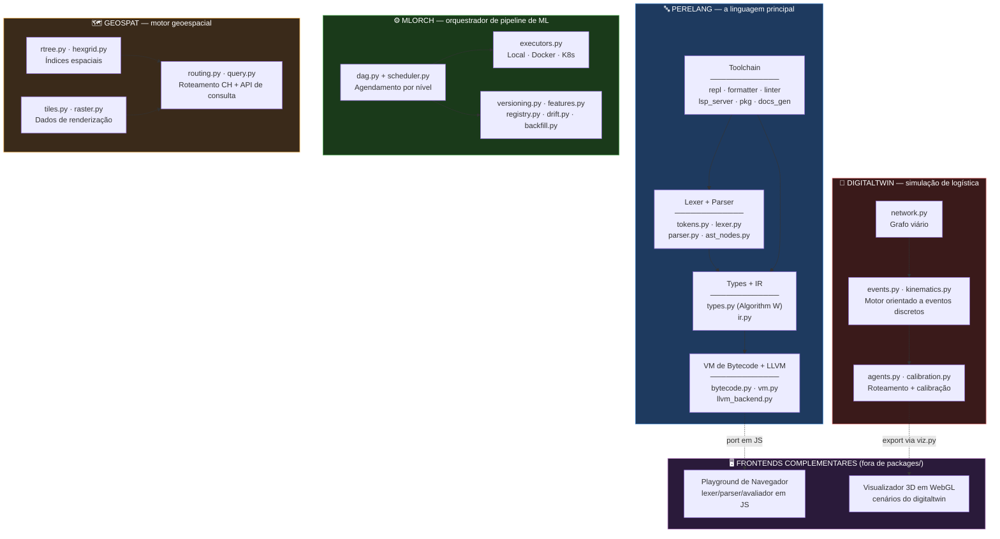
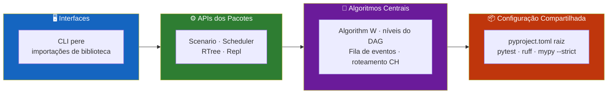
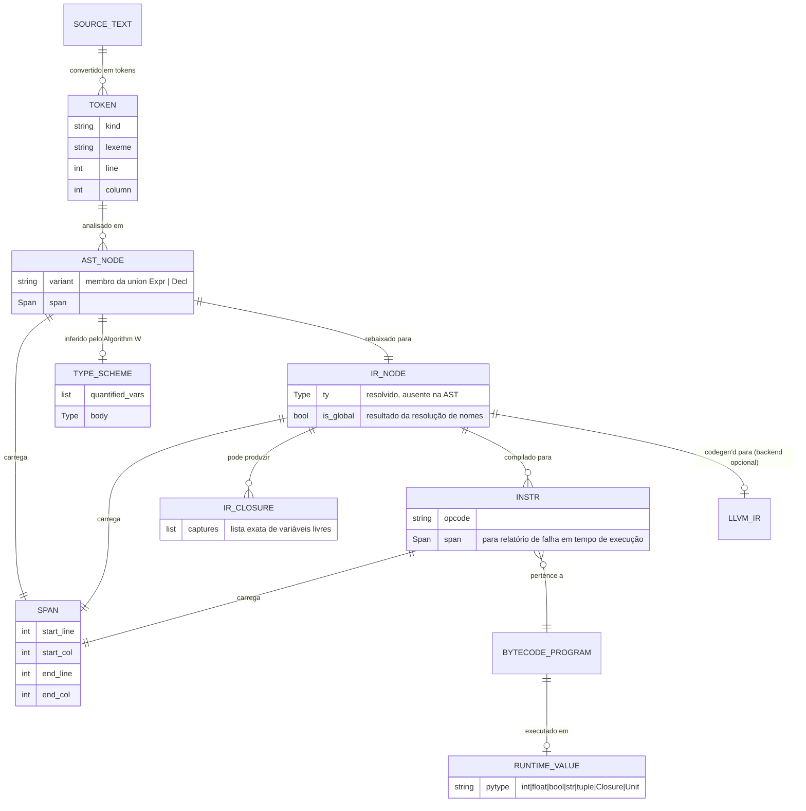
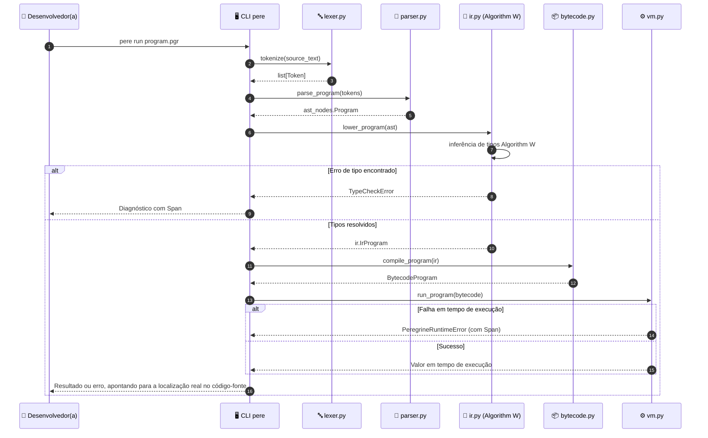
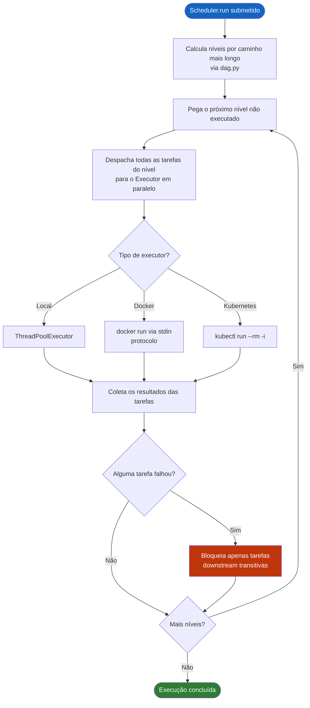
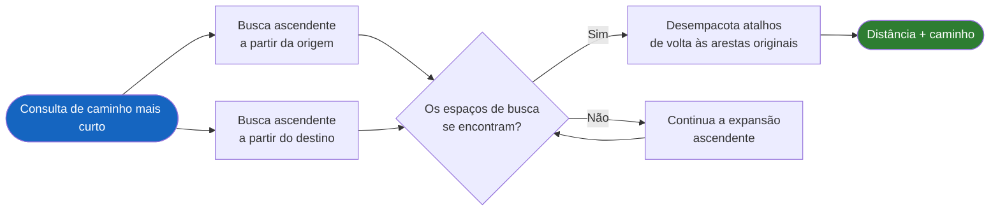
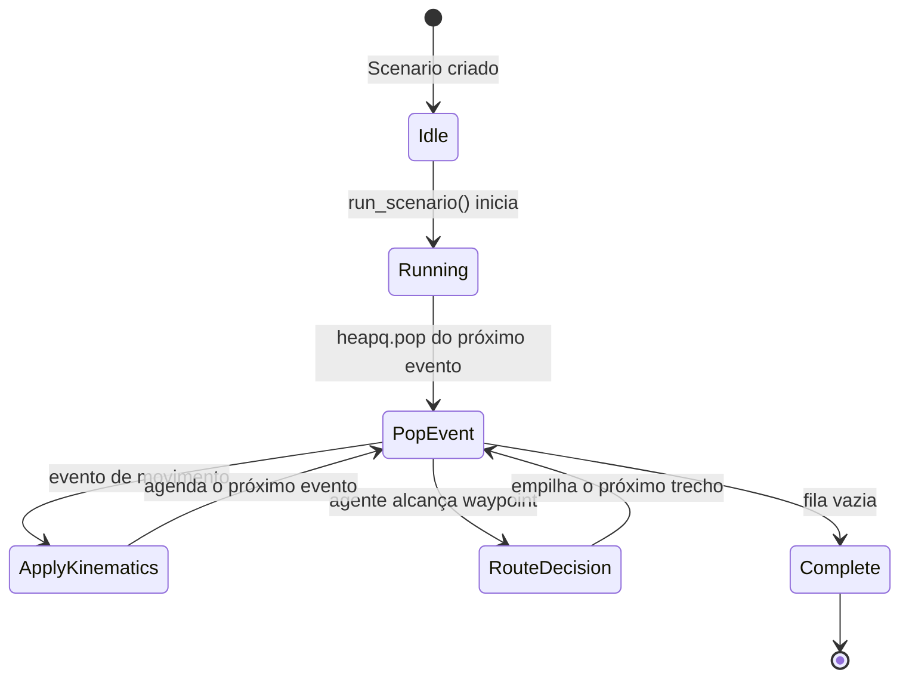
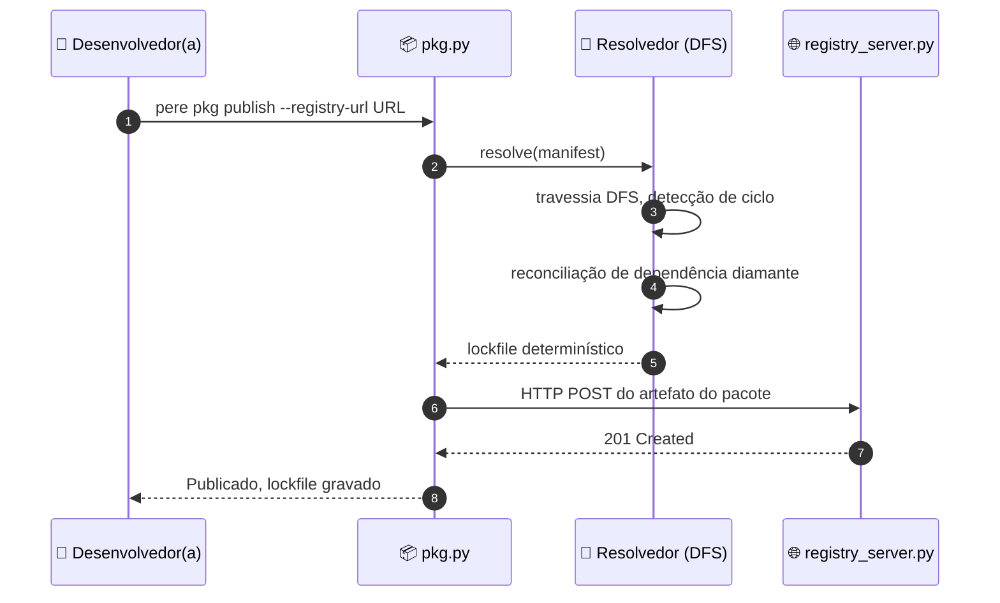
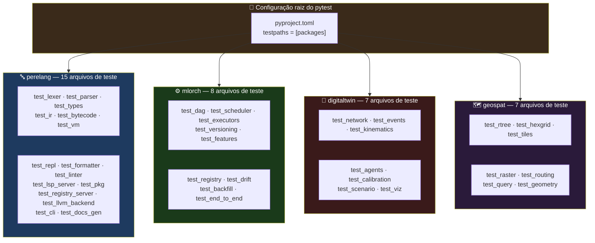

<div align="center">

**🌐 Choose Language / Selecione o Idioma / Elija el Idioma**

[](README.md)&nbsp;&nbsp;&nbsp;[]()&nbsp;&nbsp;&nbsp;[](README_ES.md)

</div>

---

<div align="center">

```
██████╗ ███████╗██████╗ ███████╗ ██████╗ ██████╗ ██╗███╗   ██╗███████╗
██╔══██╗██╔════╝██╔══██╗██╔════╝██╔════╝ ██╔══██╗██║████╗  ██║██╔════╝
██████╔╝█████╗  ██████╔╝█████╗  ██║  ███╗██████╔╝██║██╔██╗ ██║█████╗
██╔═══╝ ██╔══╝  ██╔══██╗██╔══╝  ██║   ██║██╔══██╗██║██║╚██╗██║██╔══╝
██║     ███████╗██║  ██║███████╗╚██████╔╝██║  ██║██║██║ ╚████║███████╗
╚═╝     ╚══════╝╚═╝  ╚═╝╚══════╝ ╚═════╝ ╚═╝  ╚═╝╚═╝╚═╝  ╚═══╝╚══════╝
      Um Monorepo de Quatro Sistemas Python Construídos do Zero
```

---

[](https://www.python.org/)
[](https://pypi.org/project/llvmlite/)
[](https://typer.tiangolo.com/)
[](https://pytest.org/)
[](https://docs.astral.sh/ruff/)
[](https://mypy-lang.org/)
[](LICENSE)

<br/>

> **Quatro sistemas independentes construídos do zero, sem nenhum framework fazendo o trabalho pesado:**
> **uma linguagem de programação com um toolchain completo, um orquestrador de ML, um simulador de logística e um motor geoespacial.**

<br/>


</div>

---

## 📑 Índice

<details>
<summary>▶️ <strong>Clique para expandir / recolher esta seção</strong></summary>

<table>
<tr>
<td valign="top" width="50%">

**🏗️ Sistema**
- [Visão Geral](#-visão-geral)
- [Arquitetura do Sistema](#-arquitetura-do-sistema)
- [Stack Tecnológica](#-stack-tecnológica)
- [Padrões de Projeto](#-padrões-de-projeto-aplicados)
- [Estrutura do Projeto](#-estrutura-do-projeto)

**📦 Módulos**
- [perelang — a linguagem](#-perelang--a-linguagem)
- [mlorch — orquestrador de ML](#-mlorch--orquestrador-de-pipeline-de-ml)
- [digitaltwin — simulação de logística](#-digitaltwin--simulação-de-logística-urbana)
- [geospat — motor geoespacial](#-geospat--motor-de-análise-geoespacial)
- [Frontends complementares](#-frontends-complementares)

</td>
<td valign="top" width="50%">

**💼 Negócio**
- [Regras de Negócio](#-regras-de-negócio)
- [Requisitos Funcionais](#-requisitos-funcionais)
- [Requisitos Não Funcionais](#-requisitos-não-funcionais)

**📐 Design**
- [Modelo de Dados](#-modelo-de-dados)
- [Fluxos do Sistema](#-fluxos-do-sistema)
- [Fluxo do Pipeline do Compilador](#fluxo-do-pipeline-do-compilador)
- [Fluxo de Agendamento do DAG](#fluxo-de-agendamento-do-dag)
- [Fluxo de Consulta de Roteamento por CH](#fluxo-de-consulta-de-contraction-hierarchy)

**🔐 Segurança & Operações**
- [Segurança](#-segurança)
- [Instalação & Execução](#-instalação--execução)
- [Testes Automatizados](#-testes-automatizados)
- [Métricas & Monitoramento](#-métricas--monitoramento)
- [Limitações Conhecidas](#-limitações-conhecidas)

</td>
</tr>
</table>

---

</details>

## 🌟 Visão Geral

<details>
<summary>▶️ <strong>Clique para expandir / recolher esta seção</strong></summary>

**Peregrine** é um monorepo de quatro sistemas Python independentes, cada um construído do zero sem nenhum framework fazendo o trabalho pesado: **`perelang`**, uma linguagem de programação com um toolchain completo (lexer, parser, verificador de tipos Hindley-Milner, IR, VM de bytecode, um backend JIT em LLVM, REPL, formatter, linter, servidor LSP, gerenciador de pacotes, gerador de documentação); **`mlorch`**, um orquestrador de pipeline de ML com um agendador de DAG escrito à mão; **`digitaltwin`**, um motor de simulação de logística urbana orientado a eventos discretos; e **`geospat`**, um motor de análise geoespacial com uma R-tree e um roteador por contraction-hierarchy escritos à mão.

No estado atual do repositório: **736 testes passando** (2 apropriadamente pulados — um teste dependente de Docker e outro de daemon Kubernetes, sem daemon acessível neste ambiente), **zero ocorrências de `ruff`**, **zero ocorrências de `mypy --strict`**, em **88 arquivos de código-fonte** e quatro pacotes instaláveis via `pip install -e` sob `packages/`. Dois frontends complementares em JavaScript, também escritos à mão — um playground de navegador para a linguagem e um visualizador 3D em WebGL de cenários para o `digitaltwin` — são publicados como páginas independentes ao lado do repositório, fora de qualquer pacote instalável.

Os quatro pacotes compartilham um único `pyproject.toml` raiz para a configuração de `pytest`/`ruff`/`mypy`, uma escolha deliberada documentada na [ADR 0001](docs/adr/0001-four-large-packages-not-many-small-ones.md): quatro pacotes grandes e coesos em vez de dezenas de pacotes finos, alinhado com a forma como o ecossistema de empacotamento do Python realmente espera ser usado. Cada pacote segue o mesmo estilo interno independente do domínio: algoritmos centrais escritos à mão, dataclasses congeladas (frozen) para valores imutáveis, instruções `match` sobre aliases de tipo `Union` para despacho exaustivo (verificado por `mypy --strict`, não apenas por convenção), e hierarquias de exceção estreitas que nunca sombreiam um builtin do Python.

### 🎯 Objetivos do Sistema

| Objetivo | Descrição |
|-----------|-------------|
| 🔤 **Um toolchain de linguagem de verdade** | `perelang` cobre desde o lexing até um backend JIT em LLVM, além de REPL, formatter, linter, LSP e gerenciador de pacotes |
| 🧬 **Inferência Hindley-Milner genuína** | Algorithm W com `unify`, um occurs-check e polimorfismo de let, comprovável via `TestLetPolymorphism` |
| ⚙️ **Um agendador de DAG sem Airflow** | `mlorch` escreve à mão o agendamento nível a nível, retentativas e contenção de falhas sobre um grafo `networkx` |
| 🚚 **Simulação orientada a eventos, não por polling** | O relógio do `digitaltwin` é apoiado em `heapq`; o movimento é orientado a eventos |
| 🗺️ **Estruturas de dados espaciais escritas à mão** | `geospat` implementa sua própria R-tree, grade hierárquica e roteador por contraction-hierarchy |
| 🧪 **Correção comprovável, não apenas testes verdes** | Profundidade de recursão, independência de closures e a concordância de distância CH-vs-Dijkstra são diretamente verificadas |
| 📖 **Escopo documentado, não lacunas escondidas** | Todo corte de escopo deliberado é declarado inline no docstring do módulo responsável e em `docs/ROADMAP.md` |
| 🖥️ **Frontends sem framework** | O playground de navegador e o visualizador WebGL são escritos à mão, sem Three.js, sem gerador de parser |

---

</details>

## 🏗️ Arquitetura do Sistema

<details>
<summary>▶️ <strong>Clique para expandir / recolher esta seção</strong></summary>

### Diagrama de Módulos



### Camadas de Arquitetura



---

</details>

## 🛠️ Stack Tecnológica

<details>
<summary>▶️ <strong>Clique para expandir / recolher esta seção</strong></summary>

<table>
<thead>
<tr>
<th>Camada</th>
<th>Tecnologia</th>
<th>Versão</th>
<th>Finalidade</th>
</tr>
</thead>
<tbody>
<tr>
<td rowspan="2"><strong>🧠 Linguagem</strong></td>
<td>Python</td>
<td>&gt;=3.12</td>
<td>Obrigatório para todos os pacotes (<code>requires-python</code> em cada <code>pyproject.toml</code>)</td>
</tr>
<tr>
<td>modo estrito do mypy</td>
<td>strict = true</td>
<td>Aplicado em todo o repositório, <code>namespace_packages</code> + <code>explicit_package_bases</code></td>
</tr>
<tr>
<td rowspan="2"><strong>🔤 núcleo do perelang</strong></td>
<td>llvmlite (extra opcional)</td>
<td>&gt;=0.48</td>
<td>Backend JIT (<code>llvm_backend.py</code>) — compilação MCJIT do IR da linguagem</td>
</tr>
<tr>
<td>typer</td>
<td>—</td>
<td>Sustenta a CLI <code>pere</code> (<code>cli.py</code>)</td>
</tr>
<tr>
<td rowspan="2"><strong>⚙️ mlorch</strong></td>
<td>networkx</td>
<td>—</td>
<td>Armazenamento de grafo, ordenação topológica, detecção de ciclos em <code>dag.py</code> (a política de agendamento é escrita à mão)</td>
</tr>
<tr>
<td>ThreadPoolExecutor / docker / kubectl</td>
<td>stdlib / subprocess de CLI</td>
<td><code>LocalExecutor</code>, <code>DockerExecutor</code>, <code>KubernetesExecutor</code> em <code>executors.py</code></td>
</tr>
<tr>
<td rowspan="2"><strong>🚚 digitaltwin</strong></td>
<td>networkx</td>
<td>—</td>
<td>Base do grafo viário para <code>network.py</code>, roteamento Dijkstra em <code>agents.py</code></td>
</tr>
<tr>
<td>matplotlib (opcional)</td>
<td>—</td>
<td>Gráfico 2D adicional em <code>viz.py</code>; a exportação JSON/DataFrame é o caminho principal</td>
</tr>
<tr>
<td rowspan="2"><strong>🗺️ geospat</strong></td>
<td>numpy</td>
<td>—</td>
<td>Base raster em <code>raster.py</code> (georreferenciamento, reamostragem, declividade/orientação)</td>
</tr>
<tr>
<td>pandas</td>
<td>—</td>
<td>Usado junto com o armazenamento offline de <code>mlorch.features</code> e algumas exportações tabulares</td>
</tr>
<tr>
<td rowspan="3"><strong>🧪 Portões de qualidade</strong></td>
<td>pytest</td>
<td>—</td>
<td><code>testpaths = ["packages"]</code>, configuração no <code>pyproject.toml</code> de nível raiz</td>
</tr>
<tr>
<td>ruff</td>
<td>line-length 110</td>
<td>Conjuntos de regras <code>E, F, I, UP, B, SIM, N</code>, alvo <code>py312</code></td>
</tr>
<tr>
<td>mypy</td>
<td>--strict</td>
<td><code>mypy_path</code> abrange as quatro árvores <code>src/</code>; stubs de <code>networkx</code>/<code>pandas</code>/<code>llvmlite</code> ignorados explicitamente</td>
</tr>
<tr>
<td rowspan="2"><strong>🖥️ Frontends complementares</strong></td>
<td>JavaScript escrito à mão</td>
<td>—</td>
<td>Playground de navegador: port em JS do lexer/parser/avaliador de árvore, sem port do verificador de tipos</td>
</tr>
<tr>
<td>WebGL (sem Three.js)</td>
<td>—</td>
<td>Visualizador 3D de cenários para exportações de <code>digitaltwin.viz</code>, câmera orbital, linha do tempo navegável</td>
</tr>
</tbody>
</table>

---

</details>

## 🎨 Padrões de Projeto Aplicados

<details>
<summary>▶️ <strong>Clique para expandir / recolher esta seção</strong></summary>

| Padrão | Onde | Justificativa |
|---------|-------|-----------|
| 🧵 **Pipeline** | `perelang`: lexer → parser → IR (`lower_program`) → bytecode (`compile_program`) → VM (`run_program`) | Cada estágio tem uma única responsabilidade e uma transição tipada para o próximo |
| 🌳 **Descida Recursiva + Precedence Climbing** | `parser.py` | A cadeia completa de operadores binários (`\|\| → && → equality → comparison → additive → multiplicative → unary → call/primary`) é analisada sem um gerador |
| 🧩 **Tipo de dado algébrico via `Union` + `match`** | `Expr`/`Decl` de `ast_nodes.py`, todo consumidor terminando em `case _: assert_never(...)` | Adicionar uma variante faz o `mypy --strict` sinalizar todo `match` não tratado, a garantia de uma union discriminada sem uma classe selada |
| 🏛️ **Strategy** | `digitaltwin.agents` (`nearest_neighbor` vs. `clarke_wright_routes` via `Scenario.routing_strategy`); `geospat.routing` (Dijkstra como base vs. contraction hierarchy) | Algoritmos intercambiáveis atrás de uma única superfície de chamada |
| 🔌 **Protocol / Adapter** | Protocolo `mlorch.executors.Executor` implementado por `LocalExecutor`, `DockerExecutor`, `KubernetesExecutor` | O agendador é agnóstico a onde uma tarefa realmente é executada |
| 🧱 **Armazenamento endereçado por conteúdo** | `mlorch.versioning` — hashing SHA-256 com um manifesto JSON | Deduplica tanto objetos de dataset em disco quanto entradas de histórico duplicadas consecutivas |
| 🧮 **Builder** | `geospat.query.Query(index).within(bbox)...execute()` | Uma API de consulta espacial fluente em vez de uma DSL textual analisada separadamente |
| 🕳️ **Falhar de forma ruidosa, nunca no-op** | `DockerExecutor`/`KubernetesExecutor` quando nenhum daemon/cluster está acessível | Uma dependência ausente gera um erro nomeado em vez de pular o trabalho silenciosamente |
| 🧾 **Hierarquias de exceção estreitas** | `errors.py` em cada pacote (`TypeCheckError`, `PeregrineRuntimeError`, `LlvmBackendUnsupportedError`, ...) | Uma classe por categoria de falha, sempre terminando em `Error`, nunca sombreando um builtin |
| 🧊 **Objetos de valor imutáveis** | Dataclasses congeladas por toda parte (`ast_nodes.py`, nós de IR, `Span`) | O compartilhamento estrutural é seguro por construção; sem bugs acidentais de aliasing |

---

</details>

## 📁 Estrutura do Projeto

<details>
<summary>▶️ <strong>Clique para expandir / recolher esta seção</strong></summary>

```
peregrine/
│
├── 📄 pyproject.toml                    # Configuração compartilhada de pytest/ruff/mypy para os quatro pacotes
├── 📄 LICENSE
├── 📄 README.md                         # Este arquivo (inglês, primário)
│
├── 📂 docs/
│   ├── 📄 ARCHITECTURE.md               # Design completo de pipeline/módulos por pacote
│   ├── 📄 ROADMAP.md                    # Limites de escopo deliberados vs. trabalho futuro genuíno
│   └── 📂 adr/                          # 5 Registros de Decisão Arquitetural (ADRs)
│       ├── 0001-four-large-packages-not-many-small-ones.md
│       ├── 0002-arithmetic-monomorphic-over-int.md
│       ├── 0003-llvm-backend-scope-cuts.md
│       ├── 0004-hand-rolled-lsp-transport.md
│       └── 0005-local-package-registry.md
│
└── 📂 packages/
    ├── 📂 perelang/                     # O carro-chefe: linguagem + toolchain completo
    │   ├── 📄 pyproject.toml            # console_scripts: pere = perelang.cli:main
    │   ├── 📂 src/perelang/
    │   │   ├── lexer.py / tokens.py     # Tokenizador escrito à mão
    │   │   ├── parser.py / ast_nodes.py # Parser de descida recursiva, AST em dataclass congelada
    │   │   ├── types.py                 # Hindley-Milner (Algorithm W)
    │   │   ├── ir.py                    # Segundo IR, tipos resolvidos, closures explícitas
    │   │   ├── bytecode.py / vm.py      # Bytecode de pilha + interpretador
    │   │   ├── llvm_backend.py          # Backend JIT com llvmlite
    │   │   ├── repl.py                  # Núcleo de REPL testável
    │   │   ├── formatter.py / linter.py # Pretty-printer guiado por AST, verificações estáticas
    │   │   ├── lsp_server.py            # JSON-RPC-sobre-stdio escrito à mão
    │   │   ├── pkg.py / registry_server.py  # Resolvedor de dependências + registro HTTP
    │   │   ├── docs_gen.py              # Extrator de assinaturas + comentários
    │   │   └── cli.py                   # Ponto de entrada `pere` (Typer)
    │   ├── 📂 examples/                 # Programas .pgr executáveis (fibonacci, closures, ...)
    │   ├── 📂 syntax/                   # Gramática TextMate para destaque de sintaxe no editor
    │   └── 📂 tests/                    # 15 arquivos de teste
    │
    ├── 📂 mlorch/                       # Orquestrador de pipeline de ML
    │   ├── 📂 src/mlorch/
    │   │   ├── dag.py / scheduler.py    # Modelo de DAG + execução nível a nível
    │   │   ├── executors.py             # Executores Local / Docker / Kubernetes
    │   │   ├── versioning.py            # Armazenamento de dataset endereçado por conteúdo
    │   │   ├── features.py              # Feature stores offline (pandas) + online (dict)
    │   │   ├── registry.py              # Registro de modelos, promoção de estágio
    │   │   ├── drift.py                 # PSI + estatística KS implementadas à mão
    │   │   └── backfill.py              # Computação incremental de partições
    │   └── 📂 tests/                    # 8 arquivos de teste
    │
    ├── 📂 digitaltwin/                  # Simulação de logística urbana
    │   ├── 📂 src/digitaltwin/
    │   │   ├── network.py               # Geradores de grafo viário em grade / geométrico-aleatório
    │   │   ├── events.py                # Fila de eventos e relógio apoiados em heapq
    │   │   ├── kinematics.py            # Movimento de aceleração constante em forma fechada
    │   │   ├── agents.py                # Roteamento por vizinho mais próximo + Clarke-Wright
    │   │   ├── calibration.py           # Busca de parâmetros por seção áurea
    │   │   ├── scenario.py              # API pública: Scenario, run_scenario()
    │   │   └── viz.py                   # Exportação JSON/DataFrame + gráfico matplotlib opcional
    │   └── 📂 tests/                    # 7 arquivos de teste
    │
    └── 📂 geospat/                      # Motor de análise geoespacial
        ├── 📂 src/geospat/
        │   ├── rtree.py                 # R-tree com quadratic-split de Guttman
        │   ├── hexgrid.py               # Índice de células em quadtree (documentado como não-H3)
        │   ├── tiles.py                 # Geração de vector tiles slippy z/x/y
        │   ├── raster.py                # Operações raster apoiadas em numpy (declividade/orientação, média focal)
        │   ├── routing.py               # Roteador Dijkstra + contraction-hierarchy
        │   └── query.py                 # Construtor fluente de consultas espaciais
        └── 📂 tests/                    # 7 arquivos de teste
│
├── 📄 README.md                          # 🇺🇸 Inglês (primário)
├── 📄 README_PT.md                       # 🇧🇷 Português
└── 📄 README_ES.md                       # 🇪🇸 Español
```

---

</details>

## 📦 Módulos do Sistema

<details>
<summary>▶️ <strong>Clique para expandir / recolher esta seção</strong></summary>

### 🔤 perelang — a linguagem

O pacote carro-chefe: o toolchain ao redor do compilador central é, em si, a maior parte do esforço de engenharia, não uma reflexão tardia.

| Estágio | Arquivo | Responsabilidade |
|-------|------|-----------------|
| Lexer | `lexer.py`, `tokens.py` | Tokenizador de passagem única, rastreamento de linha/coluna, comentários `//` descartados (recuperados separadamente por `docs_gen.py`) |
| Parser | `parser.py`, `ast_nodes.py` | Descida recursiva + precedence climbing; cada nó é uma dataclass congelada que carrega um `Span` |
| Verificador de tipos | `types.py` | Algorithm W: `Substitution`, `unify` com occurs-check, `TypeScheme`/`generalize`/`instantiate`, recursão estilo letrec |
| IR | `ir.py` | Segunda representação com tipos resolvidos, resolução de nomes concluída (`IrName.is_global`), capturas de closure explícitas |
| Bytecode + VM | `bytecode.py`, `vm.py` | Conjunto de instruções de máquina de pilha; valores em tempo de execução são tipos Python nativos, não uma union marcada escrita à mão |
| Backend LLVM | `llvm_backend.py` | JIT baseado em `llvmlite` via MCJIT; cobre Int/Bool/Float, closures, String/List, globais `let` de nível superior |
| REPL | `repl.py` | Núcleo testável `Repl.submit`/`run_lines`, separado de I/O; reexecuta a sessão completa a cada submissão |
| Formatter | `formatter.py` | Pretty-printer idempotente guiado por AST que rederiva parênteses |
| Linter | `linter.py` | Bindings/parâmetros não usados, ramos if/else idênticos, shadowing |
| Servidor LSP | `lsp_server.py` | JSON-RPC-sobre-stdio escrito à mão; hover, ir-para-definição, referências, rename, completion |
| Gerenciador de pacotes | `pkg.py`, `registry_server.py` | Resolvedor de dependências por DFS, detecção de ciclo/diamante, lockfile determinístico; registro local ou HTTP |
| Gerador de documentação | `docs_gen.py` | Extrai assinaturas inferidas + sequências de comentários precedentes para Markdown |
| CLI | `cli.py` | Ponto de entrada `pere` (Typer): `run`, `check`, `repl`, `fmt`, `lint`, `docs`, `lsp`, `pkg *`, `registry serve` |

**Limite de escopo declarado e permanente**: os operadores originais `+ - * / %` são tipados monomorficamente apenas sobre `Int`, sem coerção implícita — `Float` tem seu próprio conjunto de operadores (`+. -. *. /.`). Veja a [ADR 0002](docs/adr/0002-arithmetic-monomorphic-over-int.md).

---

### ⚙️ mlorch — Orquestrador de Pipeline de ML

| Módulo | Responsabilidade |
|--------|-----------------|
| `dag.py` | Modelo `Task`/`DAG`; armazenamento de grafo, ordenação topológica e detecção de ciclos delegados ao `networkx` |
| `scheduler.py` | Política de agendamento escrita à mão: agrupamento elegível para paralelismo via níveis de caminho mais longo, falhas bloqueiam apenas o downstream transitivo |
| `executors.py` | Protocolo `Executor`; `LocalExecutor` (`ThreadPoolExecutor`), `DockerExecutor` (`docker run` via stdin), `KubernetesExecutor` (`kubectl run --rm -i`) |
| `versioning.py` | Armazenamento de dataset endereçado por conteúdo via SHA-256 com um manifesto JSON, deduplicando objetos e histórico |
| `features.py` | Feature store offline (pandas, chaveada por entidade+timestamp) e online (dict em memória), ponte `materialize()` |
| `registry.py` | Versionamento de modelos com metadados (parâmetros, métricas, linhagem) e promoção de estágio |
| `drift.py` | PSI e estatística KS de duas amostras implementadas à mão — sem dependência de `scipy` |
| `backfill.py` | Computação incremental de partições reaproveitando o histórico de `versioning.py` como manifesto de "já feito" |

`DockerExecutor`/`KubernetesExecutor` recusam-se ruidosamente em vez de virar no-op silenciosamente quando nenhum daemon/cluster está acessível.

---

### 🚚 digitaltwin — Simulação de Logística Urbana

| Módulo | Responsabilidade |
|--------|-----------------|
| `network.py` | Grafo viário apoiado em `networkx` com geradores sintéticos em grade com seed e geométrico-aleatório |
| `events.py` | Fila de eventos e relógio de simulação apoiados em `heapq` — a peça estrutural; orientado a eventos, não em passo de tempo fixo |
| `kinematics.py` | Movimento trapezoidal/triangular de aceleração constante em forma fechada por segmento |
| `agents.py` | Planejamento de rotas; heurística de rota única por vizinho mais próximo e heurística multi-veículo de economias `clarke_wright_routes` |
| `calibration.py` | Busca por seção áurea que recupera um parâmetro de velocidade conhecido a partir de dados sintéticos |
| `scenario.py` | API pública — `Scenario` + `run_scenario()`, `routing_strategy` seleciona a heurística |
| `viz.py` | Exportação de trajetória e rede em JSON/`pandas.DataFrame`, gráfico 2D `matplotlib` opcional |

---

### 🗺️ geospat — Motor de Análise Geoespacial

| Módulo | Responsabilidade |
|--------|-----------------|
| `rtree.py` | R-tree escrita à mão com tratamento de overflow por quadratic-split de Guttman |
| `hexgrid.py` | Quadtree sobre um plano equiretangular com IDs de célula estilo quadkey — explicitamente **não** é H3 real |
| `tiles.py` | Geração de vector tiles slippy `z/x/y` (recorte de Liang-Barsky e Sutherland-Hodgman) |
| `raster.py` | Rasters apoiados em `numpy` com metadados de georreferenciamento, reamostragem, declividade/orientação, média focal |
| `routing.py` | Dijkstra como base mais um roteador por contraction-hierarchy com ordenação de edge-difference real e recalculada dinamicamente |
| `query.py` | API de consulta espacial fluente no padrão builder |

---

### 🖥️ Frontends Complementares

Duas páginas independentes existem ao lado do repositório, fora de qualquer pacote instalável.

| Frontend | Consome | Honestidade notável |
|----------|----------|------------------|
| Playground de navegador | Port em JS escrito à mão de `lexer.py`/`parser.py` mais um avaliador de árvore | Deliberadamente pula o verificador Hindley-Milner; o rodapé declara isso, o toolchain em Python permanece autoritativo |
| Visualizador 3D de cenários em WebGL | JSON de `digitaltwin.viz.export_network()` / `export_trajectories()` | Câmera orbital, sem Three.js, navegável por tempo simulado, suporta colar um cenário exportado real |

---

</details>

## 💼 Regras de Negócio

<details>
<summary>▶️ <strong>Clique para expandir / recolher esta seção</strong></summary>

### 🔤 Sistema de Tipos & Regras da Linguagem

| # | Regra | Aplicação |
|---|------|-------------|
| RN-01 | Operadores aritméticos inteiros (`+ - * / %`) unificam apenas para `Int`; sem coerção numérica implícita | `Inferencer`, `unify` em `types.py` |
| RN-02 | Aritmética de ponto flutuante usa um conjunto de operadores distinto (`+. -. *. /.`) | `Inferencer._FLOAT_ARITHMETIC` |
| RN-03 | Bindings `let` são de atribuição única; não há reatribuição na linguagem | `ast_nodes.py`, aplicado pela gramática do parser |
| RN-04 | Closures capturam variáveis livres por valor no momento da criação | `IrClosure.captures` em `ir.py`, correto por causa da RN-03 |
| RN-05 | Toda falha em tempo de execução carrega o `Span` real de origem da operação que falhou | `Span` propagado de `ir.py` → `bytecode.py` → `vm.py` |
| RN-06 | A fronteira `entry` do LLVM só faz marshaling de Int/Bool/Float; outros tipos geram um erro nomeado | `LlvmBackendUnsupportedError` em `llvm_backend.py` |

### ⚙️ Regras de Execução do mlorch

| # | Regra | Aplicação |
|---|------|-------------|
| RN-07 | A falha de uma tarefa bloqueia apenas suas tarefas downstream transitivas, não o DAG inteiro | `scheduler.py` |
| RN-08 | Tarefas no mesmo nível do DAG (sem dependência entre elas) são elegíveis para paralelismo | Nivelamento por caminho mais longo em `dag.py` |
| RN-09 | `DockerExecutor`/`KubernetesExecutor` recusam-se ruidosamente quando nenhum daemon/cluster está acessível | `executors.py` |
| RN-10 | Reversionar dados idênticos não cria um objeto ou entrada de histórico duplicados | Dedup endereçada por conteúdo em `versioning.py` |

### 🚚 Regras de Simulação do digitaltwin

| # | Regra | Aplicação |
|---|------|-------------|
| RN-11 | O tempo de simulação avança estritamente por evento, nunca por ticks de polling fixos | Relógio apoiado em `heapq` em `events.py` |
| RN-12 | O movimento do veículo segue cinemática em forma fechada, não aproximação numérica iterativa | `kinematics.py` |
| RN-13 | A heurística de roteamento é selecionada uma vez por `Scenario`, não misturada no meio da execução | `routing_strategy` em `scenario.py` |

### 🗺️ Regras de Indexação do geospat

| # | Regra | Aplicação |
|---|------|-------------|
| RN-14 | O overflow de nó da R-tree sempre é resolvido via quadratic-split de Guttman | `rtree.py` |
| RN-15 | Atalhos de contraction-hierarchy só são criados quando a busca por testemunha (witness search) prova que são necessários | `routing.py` |
| RN-16 | `hexgrid.py` é documentado como um análogo simplificado, nunca apresentado como H3 verdadeiro | Docstring do módulo + `docs/ARCHITECTURE.md` |

---

</details>

## ✅ Requisitos Funcionais

<details>
<summary>▶️ <strong>Clique para expandir / recolher esta seção</strong></summary>

| ID | Requisito | Prioridade | Status |
|----|-------------|----------|--------|
| **RF-01** | `pere run <file>.pgr` deve executar um programa via a VM de bytecode | 🔴 Alta | ✅ Implementado |
| **RF-02** | `pere run <file>.pgr --backend llvm` deve executar via o backend JIT em LLVM | 🔴 Alta | ✅ Implementado |
| **RF-03** | `pere repl` deve fornecer uma sessão interativa reavaliando o código-fonte acumulado | 🟡 Média | ✅ Implementado |
| **RF-04** | `pere check` deve verificar tipos de um arquivo sem executá-lo | 🟡 Média | ✅ Implementado |
| **RF-05** | `pere fmt` deve reformatar um arquivo de forma idempotente | 🟢 Baixa | ✅ Implementado |
| **RF-06** | `pere lint` deve reportar bindings não usados, parâmetros não usados, ramos idênticos, shadowing | 🟡 Média | ✅ Implementado |
| **RF-07** | `pere docs` deve gerar documentação de API em Markdown a partir de assinaturas inferidas e comentários | 🟢 Baixa | ✅ Implementado |
| **RF-08** | `pere lsp` deve servir hover, ir-para-definição, referências, rename e completion via stdio | 🟡 Média | ✅ Implementado |
| **RF-09** | `pere pkg publish`/`install` deve resolver dependências com detecção de ciclo e diamante | 🟡 Média | ✅ Implementado |
| **RF-10** | `pere registry serve` deve executar um registro de pacotes HTTP real | 🟢 Baixa | ✅ Implementado |
| **RF-11** | `mlorch.scheduler.Scheduler` deve executar um DAG nível a nível com retentativas por tarefa | 🔴 Alta | ✅ Implementado |
| **RF-12** | `mlorch.executors` deve suportar execução local, Docker e Kubernetes sob um único protocolo | 🔴 Alta | ✅ Implementado |
| **RF-13** | `mlorch.versioning` deve endereçar datasets por conteúdo e deduplicar versões idênticas | 🟡 Média | ✅ Implementado |
| **RF-14** | `mlorch.drift` deve calcular estatísticas de drift PSI e KS sem `scipy` | 🟢 Baixa | ✅ Implementado |
| **RF-15** | `digitaltwin.scenario.run_scenario()` deve simular agentes se movendo sobre uma rede viária | 🔴 Alta | ✅ Implementado |
| **RF-16** | `digitaltwin.agents` deve suportar as estratégias de roteamento vizinho mais próximo e Clarke-Wright | 🟡 Média | ✅ Implementado |
| **RF-17** | `digitaltwin.calibration` deve recuperar um parâmetro de velocidade a partir de dados observados sintéticos | 🟢 Baixa | ✅ Implementado |
| **RF-18** | `digitaltwin.viz` deve exportar dados de rede/trajetória como JSON e `DataFrame` | 🟡 Média | ✅ Implementado |
| **RF-19** | `geospat.rtree.RTree` deve suportar inserção e consulta por intervalo com resultados corretos | 🔴 Alta | ✅ Implementado |
| **RF-20** | `geospat.routing` deve calcular caminhos mais curtos coincidindo exatamente com Dijkstra via contraction hierarchies | 🔴 Alta | ✅ Implementado |
| **RF-21** | `geospat.tiles` deve gerar vector tiles slippy `z/x/y` com recorte correto | 🟡 Média | ✅ Implementado |
| **RF-22** | `geospat.raster` deve calcular declividade/orientação e média focal coincidindo com valores calculados manualmente | 🟡 Média | ✅ Implementado |
| **RF-23** | O playground de navegador deve executar código-fonte Peregrine sem qualquer instalação local | 🟢 Baixa | ✅ Implementado |
| **RF-24** | O visualizador WebGL deve animar cenários exportados do `digitaltwin` navegáveis por tempo | 🟢 Baixa | ✅ Implementado |

---

</details>

## ⚡ Requisitos Não Funcionais

<details>
<summary>▶️ <strong>Clique para expandir / recolher esta seção</strong></summary>

| ID | Categoria | Requisito | Alvo |
|----|----------|-------------|--------|
| **RNF-01** | 🧪 Qualidade | Ocorrências de `ruff` em todo o repositório | 0 |
| **RNF-02** | 🧪 Qualidade | Ocorrências de `mypy --strict` em todo o repositório | 0 |
| **RNF-03** | 🧪 Testabilidade | Taxa de aprovação de testes nos quatro pacotes | 736 passando, 2 honestamente pulados |
| **RNF-04** | 📖 Documentação | Todo corte de escopo deliberado declarado inline no docstring do módulo responsável | 100% de cobertura, referenciado cruzadamente em `docs/ROADMAP.md` |
| **RNF-05** | 🧱 Manutenibilidade | Cada pacote é instalável independentemente via `pip install -e` | 4/4 pacotes |
| **RNF-06** | 🔀 Portabilidade | Nenhum pacote depende de GUI, servidor de banco de dados ou serviço hospedado para rodar sua suíte de testes | 0 dependências de serviço externo para `pytest` |
| **RNF-07** | ⚡ Performance | Consultas por contraction-hierarchy visitam menos nós que a ordenação por degree-sort de passagem única | Mensuravelmente menos atalhos e nós visitados (`test_routing.py`) |
| **RNF-08** | 🔐 Correção | Resultados de funções compiladas via LLVM coincidem exatamente com os resultados da VM de bytecode | Verificado cruzadamente em `test_llvm_backend.py` |
| **RNF-09** | 🧩 Extensibilidade | Adicionar uma variante de nó de AST deve ser detectado pelo verificador de tipos se não tratado | `assert_never` + `mypy --strict` |
| **RNF-10** | 📏 Estilo | Comprimento de linha do código-fonte | ≤ 110 (`ruff` `line-length`), `E501` explicitamente ignorado |
| **RNF-11** | 🧵 Concorrência | `LocalExecutor` executa tarefas com paralelismo real de threads em nível de SO | Apoiado em `ThreadPoolExecutor` |
| **RNF-12** | 🌍 Reprodutibilidade | Testes de simulação e de índice espacial usam geradores determinísticos com seed | Geradores em grade/geométrico-aleatório em `network.py` |
| **RNF-13** | 📦 Empacotamento | Nenhuma dependência em tempo de instalação exigida a menos que um pacote precise dela | `perelang`/`mlorch` listam `dependencies = []` na raiz |
| **RNF-14** | 🖥️ Independência de frontend | Páginas complementares não exigem etapa de build nem runtime de framework | JS puro escrito à mão + WebGL |
| **RNF-15** | 🧾 Rastreabilidade | Erros em tempo de execução reportam a localização exata de origem que falhou | Propagação de `Span` em `perelang` |

---

</details>

## 🗄️ Modelo de Dados

<details>
<summary>▶️ <strong>Clique para expandir / recolher esta seção</strong></summary>

Este é um monorepo de bibliotecas, não uma aplicação apoiada em banco de dados. Seu "modelo de dados" é o conjunto de estruturas centrais em memória/em disco que cada pacote define. O diagrama abaixo modela os relacionamentos conceituais entre os artefatos de compilação do `perelang`, já que esse pacote tem a forma de dados interna mais rica.

### Diagrama Entidade-Relacionamento — Artefatos de Compilação do perelang



### Estruturas em Memória de mlorch / digitaltwin / geospat

| Pacote | Estrutura | Formato |
|---------|-----------|-------|
| `mlorch` | `Task` / `DAG` | ID do nó, callable, arestas de dependência; apoiado em `networkx.DiGraph` |
| `mlorch` | Manifesto de versão de dataset | JSON: `{hash, path, created_at, parents}`, deduplicado por SHA-256 |
| `mlorch` | Entrada de registro de modelo | `{version, params, metrics, dataset_lineage, stage}` |
| `digitaltwin` | Rede viária | `networkx.Graph` com atributos de aresta `length`/`speed_limit` |
| `digitaltwin` | Evento | Tupla `(time, priority, callback)` em um `heapq` |
| `geospat` | Nó de R-tree | Caixa delimitadora + nós filhos ou entradas folha (split de Guttman em caso de overflow) |
| `geospat` | Atalho CH | `(from, to, via, weight)`, criado apenas quando a busca por testemunha prova a necessidade |
| `geospat` | Vector tile | JSON customizado: `{z, x, y, features: [{geometry, properties}]}`, não é protobuf MVT |

---

</details>

## 🔄 Fluxos do Sistema

<details>
<summary>▶️ <strong>Clique para expandir / recolher esta seção</strong></summary>

### Fluxo do Pipeline do Compilador



### Fluxo de Agendamento do DAG



### Fluxo de Consulta de Contraction Hierarchy



### Loop de Simulação por Eventos Discretos



### Fluxo de Publicação de Pacote



---

</details>

## 🔐 Segurança

<details>
<summary>▶️ <strong>Clique para expandir / recolher esta seção</strong></summary>

### Controles Implementados

| Controle | Implementação | Efeito |
|---------|---------------|--------|
| 🧾 **Segurança de tipos por construção** | `mypy --strict` nas quatro árvores `src/`, zero ocorrências | Classes inteiras de erros de tipo em tempo de execução são capturadas antes da execução |
| 🚫 **Executores que falham ruidosamente** | `DockerExecutor`/`KubernetesExecutor` recusam-se quando nenhum daemon/cluster está acessível | Nenhuma tarefa é silenciosamente pulada ou falsamente reportada como bem-sucedida |
| 🔒 **Nós de AST/IR imutáveis** | Dataclasses congeladas por todo `ast_nodes.py`, `ir.py` | Elimina uma classe de bugs de aliasing/mutação no pipeline do compilador |
| 🧮 **Integridade endereçada por conteúdo** | Hashing SHA-256 em `mlorch.versioning` | Uma versão de dataset é verificavelmente os bytes que ela afirma ser |
| 🧱 **Hierarquias de exceção estreitas** | `errors.py` por pacote, sempre terminando em `Error` | Quem chama pode capturar com precisão, nunca engolindo acidentalmente uma exceção builtin não relacionada |
| 🔍 **Verificação exaustiva de match** | `assert_never(...)` em todo ponto de despacho tipado por `Union` | Uma nova variante de AST/IR não pode passar despercebida silenciosamente |
| 🌐 **Nenhuma superfície de execução de código não confiável exposta por design** | `pere run` apenas interpreta/compila via JIT código-fonte Peregrine fornecido localmente pelo usuário | Nenhum endpoint de eval exposto à rede no próprio toolchain da linguagem |

### Limitações de Segurança Conhecidas

> [!WARNING]
> Estas são inerentes a um monorepo de sistemas de aprendizado/demonstração e devem ser compreendidas antes que qualquer componente seja exposto além de um contexto local e confiável.

| Limitação | Risco | Caminho de mitigação |
|------------|------|-----------------|
| 🌐 **`registry_server.py` não tem autenticação** | Qualquer pessoa que alcance o registro HTTP pode publicar ou instalar pacotes | Adicionar autenticação por token antes de expor além de `localhost` |
| 🖥️ **`lsp_server.py` confia implicitamente em seu peer de stdio** | Um cliente LSP é considerado não-adversarial, padrão para integrações locais de editor | Aceitável para o caso de uso pretendido de editor local; não expor por um transporte não confiável |
| 🐳 **`DockerExecutor`/`KubernetesExecutor` executam payloads de tarefa arbitrários** | Uma definição de tarefa maliciosa executa com os privilégios de Docker/`kubectl` do usuário que a invoca | Isolar ou restringir a identidade sob a qual o `mlorch` roda em qualquer ambiente compartilhado |
| 🧪 **O JIT do LLVM executa código de máquina gerado a partir de entrada do usuário** | Um programa `.pgr` malicioso compilado via `--backend llvm` executa código nativo, não um interpretador isolado (sandboxed) | Executar arquivos `.pgr` não confiáveis apenas pela VM de bytecode, não pelo backend LLVM |
| 📄 **O playground de navegador avalia código-fonte colado arbitrário no lado do cliente** | Risco padrão de execução JS de qualquer interpretador/avaliador em navegador | Nenhuma execução no lado do servidor envolvida; o risco fica restrito à própria aba do navegador do visitante |
| 🗂️ **`versioning.py` não criptografa os objetos de dataset armazenados** | Os dados em repouso são arquivos simples, endereçados por hash | Adicionar criptografia no backend de armazenamento se estiver lidando com datasets sensíveis |

---

</details>

## 🚀 Instalação & Execução

<details>
<summary>▶️ <strong>Clique para expandir / recolher esta seção</strong></summary>

### Pré-requisitos

```bash
# Python 3.12 ou mais recente
python3 --version        # espera-se 3.12+

# pip, a partir da raiz do repositório
python -m pip --version
```

### Build (instalação editável dos quatro pacotes)

```bash
# A partir da raiz do repositório — instala os quatro pacotes em modo editável
python -m pip install -e packages/perelang -e packages/mlorch -e packages/digitaltwin -e packages/geospat

# Opcional: habilita o backend JIT em LLVM do perelang
python -m pip install -e "packages/perelang[llvm]"
```

### Execução

**A linguagem, via a CLI `pere`:**

```bash
pere run packages/perelang/examples/fibonacci.pgr           # VM de bytecode
pere run packages/perelang/examples/fibonacci.pgr --backend llvm   # JIT em LLVM
pere repl                                                     # sessão interativa
pere check some_file.pgr                                      # apenas verificação de tipos
pere fmt some_file.pgr                                        # reformata no local
pere lint some_file.pgr                                       # verificações estáticas
pere docs packages/perelang/examples -o api.md                # gera documentação
pere lsp                                                       # servidor de linguagem via stdio
pere registry serve                                            # executa um registro de pacotes HTTP real
pere pkg publish --registry-url http://localhost:8000          # publica um pacote
```

**Os outros três, como bibliotecas:**

```python
from mlorch.scheduler import Scheduler
from digitaltwin.scenario import Scenario, run_scenario
from geospat.rtree import RTree
```

### Alvos de CLI / Ferramentas

| Comando | Finalidade |
|---------|-----------|
| `python -m pytest packages` | Executa todos os testes nos quatro pacotes |
| `python -m ruff check packages` | Faz lint de tudo (espera-se 0 ocorrências) |
| `python -m mypy --strict packages` | Verifica tipos de tudo (espera-se 0 ocorrências) |
| `pere run <file>.pgr [--backend llvm]` | Executa um programa Peregrine |
| `pere repl` | Sessão interativa Peregrine |
| `pere check <file>.pgr` | Verifica tipos sem executar |
| `pere fmt <file>.pgr` | Reformata no local |
| `pere lint <file>.pgr` | Análise estática |
| `pere docs <dir> -o <file>.md` | Gera documentação de API |
| `pere lsp` | Inicia o servidor de linguagem (stdio) |
| `pere pkg init / add / install / publish` | Subcomandos do gerenciador de pacotes |
| `pere registry serve` | Inicia o registro de pacotes HTTP |

### Configuração de Build

| Configuração | Valor | Declarado em |
|---------|-------|-------------|
| `requires-python` | `>=3.12` | `pyproject.toml` de cada pacote |
| Console script do `perelang` | `pere = perelang.cli:main` | `packages/perelang/pyproject.toml` |
| Extra opcional do `perelang` | `llvm = ["llvmlite>=0.48"]` | `packages/perelang/pyproject.toml` |
| Build backend | `setuptools.build_meta`, `setuptools>=68` | `pyproject.toml` de cada pacote |
| Descoberta de pacotes | `[tool.setuptools.packages.find] where = ["src"]` | `pyproject.toml` de cada pacote |
| Configuração do ruff | `line-length = 110`, regras `E,F,I,UP,B,SIM,N`, `E501` ignorado | `pyproject.toml` raiz |
| Configuração do mypy | `strict = true`, `namespace_packages = true`, `explicit_package_bases = true` | `pyproject.toml` raiz |

---

</details>

## 🧪 Testes Automatizados

<details>
<summary>▶️ <strong>Clique para expandir / recolher esta seção</strong></summary>

### Arquitetura de Testes



### Visão Geral da Suíte de Testes

| Pacote | Arquivos de teste | Cobertura notável |
|---------|-----------|--------------------|
| `perelang` | 15 | Prova de profundidade de recursão, independência de closures, `TestLetPolymorphism`, verificação cruzada de resultados LLVM-vs-VM |
| `mlorch` | 8 (incl. `test_end_to_end.py`) | Nivelamento de DAG, protocolos de conexão dos executores, estatísticas de drift, um teste ao vivo de Docker/K8s que pula honestamente |
| `digitaltwin` | 7 | Cinemática contra valores calculados manualmente, correção do agrupamento Clarke-Wright |
| `geospat` | 7 | Consultas por intervalo em R-tree vs. força bruta, concordância exata de distância CH-vs-Dijkstra, comparação de contagem de atalhos |

### Executando os Testes

```bash
# Tudo
python -m pytest packages

# Um pacote
python -m pytest packages/perelang/tests

# Um arquivo
python -m pytest packages/geospat/tests/test_routing.py -v

# Lint e verificação de tipos estrita (parte do mesmo portão de qualidade)
python -m ruff check packages
python -m mypy --strict packages
```

### Checklist de Aceitação Manual

| # | Cenário | Resultado esperado |
|---|----------|-----------------|
| 1 | `python -m pytest packages` | 736 aprovados, 2 pulados (daemon Docker/K8s ausente) |
| 2 | `python -m ruff check packages` | 0 ocorrências |
| 3 | `python -m mypy --strict packages` | 0 ocorrências |
| 4 | `pere run packages/perelang/examples/fibonacci.pgr` | Resultado de Fibonacci correto, sem erro |
| 5 | Mesmo arquivo com `--backend llvm` | Resultado idêntico à execução na VM de bytecode |
| 6 | `pere fmt` em um arquivo duas vezes | A segunda execução não produz diff (idempotente) |
| 7 | `pere lint` em um arquivo com um `let` não usado | Reporta o binding não usado |
| 8 | Abrir um arquivo `.pgr` em um editor compatível com LSP via `pere lsp` | Hover, ir-para-definição e rename funcionam |
| 9 | `pere registry serve` + `pere pkg publish` | O pacote aparece recuperável via `pere pkg install` |
| 10 | Carregar o playground de navegador, executar um programa de exemplo | Saída correta, rodapé nota que não há verificação de tipos |
| 11 | Carregar o visualizador WebGL com uma exportação do `digitaltwin` | Agentes animam ao longo das rotas, a navegação da linha do tempo funciona |

---

</details>

## 📊 Métricas & Monitoramento

<details>
<summary>▶️ <strong>Clique para expandir / recolher esta seção</strong></summary>

### Métricas do Código-Fonte

| Métrica | Valor |
|--------|-------|
| Pacotes instaláveis | 4 (`perelang`, `mlorch`, `digitaltwin`, `geospat`) |
| Arquivos de código-fonte | 88 |
| Testes passando | 736 |
| Testes apropriadamente pulados | 2 (dependentes de daemon Docker e cluster Kubernetes) |
| Ocorrências de `ruff` | 0 |
| Ocorrências de `mypy --strict` | 0 |
| Registros de Decisão Arquitetural (ADRs) | 5 |
| Frontends complementares (fora de `packages/`) | 2 |
| Subcomandos da CLI do `perelang` | 9 (`run`, `check`, `repl`, `fmt`, `lint`, `docs`, `lsp`, `pkg`, `registry`) |

### Sinais de Runtime / Qualidade

| Sinal | Fonte | Onde observar |
|--------|--------|-------------------|
| Resultado do teste por pacote | Código de saída + linha de resumo do `pytest` | Logs de CI, ou `python -m pytest packages -v` |
| Limpeza de lint | Código de saída do `ruff check` | 0 = limpo |
| Regressão de segurança de tipos | Código de saída do `mypy --strict` | 0 = limpo; qualquer valor diferente de zero bloqueia o portão de qualidade |
| Eficiência do roteamento CH | Contagens de atalhos/nós visitados em `test_routing.py` | Comparado diretamente com a baseline de degree-sort de passagem única que substituiu |
| Paridade de resultado LLVM/VM | `test_llvm_backend.py` | Saídas verificadas cruzadamente para os mesmos programas `.pgr` |
| Acessibilidade do executor | Verificação de inicialização de `DockerExecutor`/`KubernetesExecutor` | Levanta erro imediatamente se nenhum daemon/cluster está acessível |

### Comandos de Diagnóstico Úteis

```bash
# Portão de qualidade completo em uma única passagem
python -m pytest packages && python -m ruff check packages && python -m mypy --strict packages

# Conta os arquivos de código-fonte
find packages -name "*.py" -path "*/src/*" | wc -l

# Executa apenas os testes do backend LLVM (requer o extra [llvm])
python -m pytest packages/perelang/tests/test_llvm_backend.py -v

# Inspeciona o bytecode de um programa .pgr compilado sem executá-lo
pere check packages/perelang/examples/factorial.pgr
```

### Códigos de Teste / Saída Padronizados

| Código | Significado | Onde |
|------|---------|-------|
| `0` | Todos os testes passaram / lint limpo / verificação de tipos limpa | Códigos de saída de `pytest`, `ruff check`, `mypy --strict` |
| `1` | Pelo menos um teste falhou, ou ocorrências reportadas | Mesmas ferramentas |
| `skipped` | Teste explicitamente pulado, não aprovado silenciosamente | 2 casos: testes ao vivo dependentes de Docker e de Kubernetes |
| `TypeCheckError` | Erro de tipo estático levantado por `types.py` | `pere check`, `pere run` |
| `PeregrineRuntimeError` | Falha em tempo de execução com um `Span` real de origem | `pere run` (VM de bytecode) |
| `LlvmBackendUnsupportedError` | Tipo de valor não suportado na fronteira `entry` do LLVM | `pere run --backend llvm` |

---

</details>

## ⚠️ Limitações Conhecidas

<details>
<summary>▶️ <strong>Clique para expandir / recolher esta seção</strong></summary>

> [!IMPORTANT]
> Cada limitação abaixo é documentada como um **limite de escopo deliberado e permanente** em `docs/ROADMAP.md` e no próprio docstring do módulo responsável, não como uma lacuna escondida. No estado atual do repositório, a seção de "trabalho futuro genuíno" do roadmap está vazia — tudo que já esteve listada ali foi concluído.

| Categoria | Questão | Status |
|----------|-------|--------|
| 🔤 **Tipagem aritmética** | Os operadores originais `+ - * / %` são exclusivos de Int, permanentemente, por design | ➕ Intencional — veja a [ADR 0002](docs/adr/0002-arithmetic-monomorphic-over-int.md) |
| ⚙️ **Fronteira de entrada do LLVM** | O marshaling via `ctypes` na fronteira externa do JIT só suporta Int/Bool/Float | ➕ Intencional — o grafo de chamadas interno já suporta closures/String/List |
| 🖥️ **Escopo do LSP** | Sem tabela de símbolos entre arquivos, sem signature help, sem completion de acesso a membro | ➕ Intencional — a linguagem ainda não tem um sistema de `import` para resolver através dele |
| ✏️ **Preservação de comentários pelo formatter** | Comentários são descartados no estágio de lexer e não podem ser reproduzidos (round-trip) pelo formatter | ➕ Intencional — exigiria propagar a associação de comentários através de lexer e parser |
| 🐳 **Verificação ao vivo do KubernetesExecutor** | Testado unitariamente mas não exercitado contra um cluster real neste ambiente | ⚠️ Em aberto — o teste ao vivo de ponta a ponta pula honestamente em vez de simular uma aprovação |
| 📊 **Estatísticas de drift** | PSI/KS implementadas à mão, não apoiadas em `scipy` | ➕ Intencional — `scipy` indisponível neste ambiente; consistente com o espírito de construir do zero |
| 🚚 **Roteamento de veículos** | Vizinho mais próximo e Clarke-Wright são heurísticas, não um otimizador VRP exato | ➕ Intencional — VRP exato com janelas de tempo está fora de escopo |
| 🗺️ **`hexgrid.py`** | Análogo em quadtree, não a matemática hexagonal icosaédrica real do H3 | ➕ Intencional — mesma interface, simplificação documentada |
| 🗺️ **Busca por testemunha em contraction hierarchy** | Dijkstra completo e irrestrito em vez de uma busca local limitada por saltos | ➕ Intencional — as decisões de atalho são sempre corretas, apenas mais lentas de computar |
| 🗺️ **Vector tiles** | Formato JSON customizado, não protobuf Mapbox Vector Tile; o recorte de polígonos tem casos de borda documentados | ➕ Intencional — veja `geometry.py` para os casos de borda exatos |
| 🖥️ **Fidelidade do playground de navegador** | Nenhuma verificação de tipos Hindley-Milner portada para JavaScript | ➕ Intencional — o rodapé declara isso; o toolchain em Python permanece autoritativo |

> [!TIP]
> Se este projeto for estendido no futuro, o próximo passo de maior alavancagem que não está declarado em lugar nenhum como já concluído é uma tabela de símbolos entre arquivos para o servidor LSP, já que essa é a única capacidade que toda outra funcionalidade já concluída do toolchain (hover, ir-para-definição, rename) atualmente carece, ficando restrita a um único documento aberto.

</details>

---

<div align="center">

---

### 🦅 Peregrine

*Quatro sistemas, zero atalhos, todo corte de escopo declarado em voz alta.*

[](https://www.python.org/)
[]()
[]()
[]()

<br/>

```
"Um falcão-peregrino não precisa de um framework para mergulhar a trezentos quilômetros por hora.
 Ele precisa dos primitivos certos, ajustados à mão, e de nada mais no caminho."
```

</div>
